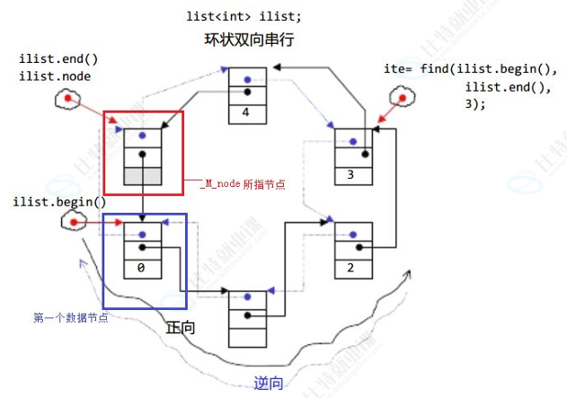
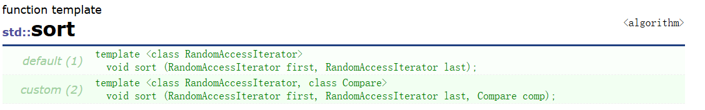
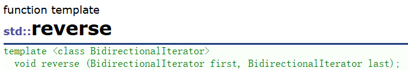
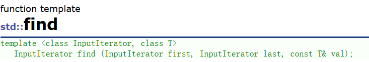
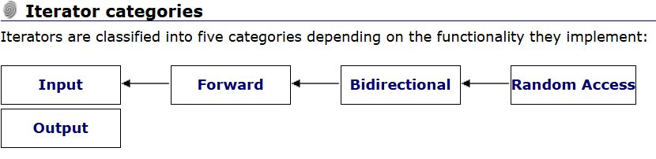

## list

### list的介绍及使用

> 带头双向循环链表




#### list的使用

> 可暂时将迭代器理解成一个指针，该指针指向list中的某个节点。
>
> 但链表的迭代器不支持加减运算


- 库中的sort只能用随机迭代器
- 所以list自己实现了一个sort，而不是用库中的





>  双向迭代器
>
> 双向是一种特殊的单项，随机是一种特殊的双向




> input output（只读和只写）是各个迭代器的父类，迭代器都可以传 



> 尽量不要用list的sort，因为效率很低！！！
>
> 测试排序效率用release版本，不要用debug

```C++
#include <iostream>
#include <list>
#include <algorithm>
#include <assert.h>


using namespace std;

void test_list1()
{
	list<int> lt;
	lt.push_back(1);
	lt.push_back(2);
	lt.push_back(3);
	lt.push_back(4);

	list<int>::iterator it = lt.begin();
	while (it != lt.end())
	{
		cout << *it << " ";
		it++;
	}
	cout << endl;

	for (auto& e : lt)
	{
		cout << e << " ";
	}
	cout << endl;

	// 不支持，要求随机迭代器
	/*sort(lt.begin(), lt.end());*/

	string s("adhsaui");
	cout << s << endl;
	sort(s.begin(), s.end());
	cout << s << endl;
}

struct A
{
public:
	A(int a1=1,int a2=1)
		:_a1(a1),_a2(a2)
	{ 
		cout << "A(int a1=1,int a2=1)" << endl;
	}

	A(const A& aa)
		:_a1(aa._a1), _a2(aa._a2)
	{
		cout << "A(const A& aa)" << endl;
	}

	int _a1;
	int _a2;
};

void test_list2()
{
	list<int> lt;
	lt.push_back(1);
	lt.emplace_back(2);
	lt.emplace_back(3);
	lt.emplace_back(4);

	for (auto& e : lt)
	{
		cout << e << " ";
	}
	cout << endl;


	list<A> lta;
	A aa1(1,1);
	lta.push_back(aa1);
	lta.push_back(A(2, 2)); //构造+拷贝构造
	//lta.push_back(3,3);

	lta.emplace_back(aa1);
	lta.emplace_back(A(2,2));
	cout << endl;
	// 支持直接传构造A对象的参数emplace_back
	lta.emplace_back(3,3);
}

void test_list3()
{
	list<int> lt;
	lt.push_back(1);
	lt.push_back(2);
	lt.push_back(3);
	lt.push_back(4);
	lt.push_back(5);
	lt.push_back(6);

	for (auto& e : lt)
	{
		cout << e << " ";
	}
	cout << endl;

	auto it = lt.begin();
	int k = 3;
	while (k--)
	{
		++it;
	}
	lt.insert(it, 30);

	for (auto& e : lt)
	{
		cout << e << " ";
	}
	cout << endl;

	int x = 0;
	cin >> x;
	it = find(lt.begin(), lt.end(), x);
	if (it != lt.end())
	{
		lt.erase(it);
	}
	for (auto& e : lt)
	{
		cout << e << " ";
	}
	cout << endl;

}

void test_list4()
{
	list<int> lt;
	lt.push_back(1);
	lt.push_back(2);
	lt.push_back(3);
	lt.push_back(4);
	lt.push_back(5);
	lt.push_back(6);

	for (auto& e : lt)
	{
		cout << e << " ";
	}
	cout << endl;

	// 升序
	lt.sort();
	//降序 - 仿函数
	//less<int> ls;
	greater<int> gt;
	lt.sort(gt);

	for (auto& e : lt)
	{
		cout << e << " ";
	}
	cout << endl;

	lt.reverse();
	for (auto& e : lt)
	{
		cout << e << " ";
	}
	cout << endl;

	reverse(lt.begin(), lt.end());
	for (auto& e : lt)
	{
		cout << e << " ";
	}
	cout << endl;
}


void test_list5()
{
	list<int> lt,lt2;
	lt.push_back(1);
	lt.push_back(2);
	lt.push_back(3);
	lt.push_back(4);
	lt.push_back(5);
	lt.push_back(6);

	lt2.push_back(1);
	lt2.push_back(3);
	lt2.push_back(4);
	lt2.push_back(7);
	lt2.push_back(27);
	lt2.push_back(68);

	// merge 合并链表会挪空一个链表
	lt.merge(lt2);


	for (auto& e : lt)
	{
		cout << e << " ";
	}
	cout << endl;

	for (auto& e : lt2)
	{
		cout << e << " ";
	}
	cout << endl;
}


void test_list6()
{
	list<int> lt;
	lt.push_back(1);
	lt.push_back(1);
	lt.push_back(3);
	lt.push_back(1);
	lt.push_back(6);

	lt.sort();
	// 去重要求是有序的
	lt.unique();

	for (auto& e : lt)
	{
		cout << e << " ";
	}
	cout << endl;
}

void test_list7()
{
	// 一个链表的节点转移给另外一个
	list<int> lt,lt2;
	list<int>::iterator it;

	for (int i = 0; i < 4; i++)
		lt.push_back(i);
	for (int i = 0; i < 3; i++)
		lt2.push_back(i*10);

	for (auto& e : lt)
	{
		cout << e << " ";
	}
	cout << endl;

	for (auto& e : lt2)
	{
		cout << e << " ";
	}
	cout << endl;


	it = lt.begin();
	++it;
	// 剪切拿走
	lt.splice(it, lt2);

	for (auto& e : lt)
	{
		cout << e << " ";
	}
	cout << endl;

	for (auto& e : lt2)
	{
		cout << e << " ";
	}
	cout << endl;
	cout << endl;

	// 把最近用的节点转移到第一个
	// 可能就得new一个在头，再删掉原来的
	// 这个时候就可以用splice转移
	// 调整当前链表节点的顺序
	list<int> lt3;
	lt3.push_back(1);
	lt3.push_back(2);
	lt3.push_back(3);
	lt3.push_back(4);
	lt3.push_back(5);
	for (auto& e : lt3)
	{
		cout << e << " ";
	}
	cout << endl;
	int x = 0;
	cin >> x;
	//it = find(lt3.begin(), lt3.end(), x);
	it = find(lt3.begin(), lt3.end(),x);
	if (it != lt3.end())
	{
		//lt3.splice(lt3.begin(), lt3, it,lt3.end());
		lt3.splice(lt3.begin(), lt3, it);
	}
	for (auto& e : lt3)
	{
		cout << e << " ";
	}
	cout << endl;
}

int main()
{

	//test_list1();
	//test_list2();
	//test_list3();
	//test_list4();
	//test_list5();
	//test_list6();
	test_list7();
	return 0;
}
```


### list模拟实现

```C++
#pragma once
#include <memory>
#include <iostream>
#include <list>
#include <string>
#include <assert.h>

namespace zhutian
{
	template<class T>
	class list_node
	{
	public:
		T _data;
		list_node<T>* _next;
		list_node<T>* _prev;

		list_node(const T& x=T())
			:_data(x),_next(nullptr),_prev(nullptr)
		{ }
	};

	template<class T,class Ref,class Ptr>
	struct list_iterator
	{
		typedef list_node<T> Node;
		typedef list_iterator<T,Ref,Ptr> Self;
		Node* _node;
		
		list_iterator(Node* n)
			:_node(n)
		{}

		Ref operator*()
		{
			return _node->_data;
		}

		Ptr operator->()
		{
			return &_node->_data;
		}

		Self& operator--()
		{
			_node = _node->_prev;
			return *this;
		}

		Self operator--(int)
		{
			Self tmp = *this;
			_node = _node->_prev;
			return tmp;
		}

		Self operator++(int)
		{
			Self tmp = *this;
			_node = _node->_next;
			return tmp;
		}

		Self& operator++()
		{
			_node = _node->_next;
			return *this;
		}

		bool operator!=(const Self& s)const
		{
			return _node != s._node;
		}

		bool operator==(const Self& s)const
		{
			return _node == s._node;
		}
		
	};

	template<class T>
	class list
	{
		typedef list_node<T> Node;
	public:
		typedef list_iterator<T, T&, T*> iterator;
		typedef list_iterator<T,const T&,const T*> const_iterator;

		void empty_init()
		{
			_head = new Node;
			_head->_next = _head;
			_head->_prev = _head;
			_size = 0;
		}

		list()
		{
			empty_init();
		}

		list(const list<T>& lt)
		{
			empty_init();
			for (auto& e : lt)
			{
				push_back(e);
			}
		}

		list(const std::initializer_list<T>& il)
		{
			empty_init();
			for (auto& e : il)
			{
				push_back(e);
			}
		}

		list& operator=(list lt)
		{
			swap(lt);
			return *this;
		}

		void swap(list& lt)
		{
			std::swap(_head, lt._head);
			std::swap(_size, lt._size);
		}

		iterator begin()
		{
			//return iterator (_head->_next);
			return _head->_next;
		}

		iterator end()
		{
			//return iterator (_head);
			return _head;
		}

		const_iterator begin()const
		{
			//return iterator (_head->_next);
			return _head->_next;
		}

		const_iterator end()const
		{
			//return iterator (_head);
			return _head;
		}

		iterator insert(iterator pos, const T& x)
		{
			Node* newnode = new Node(x);
			Node* cur = pos._node;
			Node* prev = pos._node->_prev;
			prev->_next = newnode;
			newnode->_prev = prev;
			newnode->_next = cur;
			cur->_prev = newnode;
			++_size;
			return newnode;
		}

		void push_back(const T& x)
		{
			//Node* newnode = new Node(x);
			//Node* tail = _head->_prev;

			//tail->_next = newnode;
			//newnode->_prev = tail;
			//newnode->_next = _head;
			//_head->_prev = newnode;
			//++_size;

			insert(end(), x);
		}

		void push_front(const T& x)
		{
			insert(begin(),x);
		}

		size_t size()const
		{
			return _size;
		}

		void pop_back()
		{
			erase(--end());
		}

		void pop_front()
		{
			erase(begin());
		}

		iterator erase(iterator& pos)
		{
			assert(pos != end());
			Node* cur = pos._node;
			Node* prev = pos._node->_prev;
			Node* next = pos._node->_next;
			prev->_next = next;
			next->_prev = prev;
			delete cur;
			--_size;
			return next;
		}

		bool empty()const 
		{
			return _size == 0;
		}

		void clear()
		{
			auto it = begin();
			while (it != end())
			{
				it = erase(it);
			}
		}

		~list()
		{
			clear();
			delete _head;
			_head = nullptr;
		}


	private:
		Node* _head;
		size_t _size;
	};

	template<class container>
	void print_vector(const container& v)
	{
		// 类名::名称 可能是类中的某个类型，也有可能是类静态成员
		// 规定：没有实例化的类模板里取东西，编译器不能区分这里的
		// const_iterator是类型还是静态变量
		// 这个时候在前面加一个typename就可以告诉编译器是类型
		// 这也是typename在模板template<class T>与template<typename T>一样
		// 但是class与typename不同
		// vector<T>::const_iterator it = v.begin();

		// 这里用auto更方便
		//typename vector<T>::const_iterator it = v.begin();
		auto it = v.begin();

		while (it != v.end())
		{
			std::cout << *it << " ";
			++it;
		}
		std::cout << std::endl;

		for (auto e : v)
		{
			std::cout << e << " ";
		}
		std::cout << std::endl;
	}

	template<class container>
	void print_container(const container& v)
	{
		// 类名::名称 可能是类中的某个类型，也有可能是类静态成员
		// 规定：没有实例化的类模板里取东西，编译器不能区分这里的
		// const_iterator是类型还是静态变量
		// 这个时候在前面加一个typename就可以告诉编译器是类型
		// 这也是typename在模板template<class T>与template<typename T>一样
		// 但是class与typename不同
		// vector<T>::const_iterator it = v.begin();

		// 这里用auto更方便
		//typename vector<T>::const_iterator it = v.begin();
		auto it = v.begin();

		while (it != v.end())
		{
			std::cout << *it << " ";
			++it;
		}
		std::cout << std::endl;

		for (auto e : v)
		{
			std::cout << e << " ";
		}
		std::cout << std::endl;
	}

	void teat_list1()
	{
		list<int> lt;
		lt.push_back(1);
		lt.push_back(2);
		lt.push_back(3);
		lt.push_back(4);
		lt.push_back(5);

		list<int>::iterator it = lt.begin();
		while (it != lt.end())
		{
			std::cout << *it << " ";
			//it++;
			++it;
		}
		std::cout << std::endl;

		print_container(lt);

		for (auto e : lt)
		{
			std::cout << e << " ";
		}
		std::cout << std::endl;
	}

	void teat_list2()
	{
		list<int> lt1;
		lt1.push_back(1);
		lt1.push_back(2);
		lt1.push_back(3);
		lt1.push_back(4);
		lt1.push_back(5);
	
		print_container(lt1);
		list<int> lt2(lt1);
		print_container(lt2);

		list<int> lt3;
		lt3.push_back(2);
		lt3.push_back(3);
		lt3.push_back(4);
		lt3.push_back(5);
		lt3.push_back(6);
		print_container(lt3);
		lt1 = lt3;
		print_container(lt1);

	}

	void func(const list<int>& lt)
	{
		print_container(lt);
	}

	void teat_list3()
	{
		//直接构造
		list<int> lt1({ 0,1,2,3,4,5,6,7,8,9 });
		//list<int> lt1{0,1,2,3,4,5,6,7,8,9};
		//隐式类型转换 
		list<int> lt0={ 0,1,2,3,4,5,6,7,8,9 };
		auto il = { 0,1,2,3,4,5,6,7,8,9 };
		//cout << typeid({ 0,1,2,3,4,5,6,7,8,9 }).name() << endl;
		//std::initializer_list<int>
		std::cout << typeid(il).name() << std::endl;
		std::cout << sizeof il << std::endl;
		print_container(lt1);
		func({ 0,1,2,3,4,5,6,7,8,9 ,10});


	}
}
```

