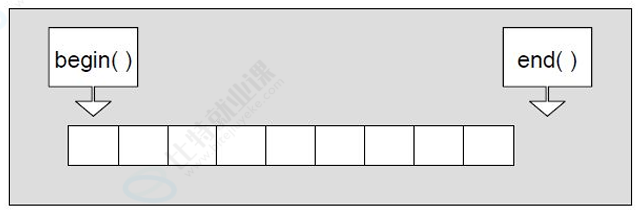
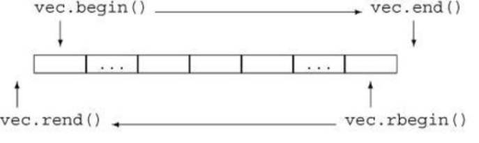
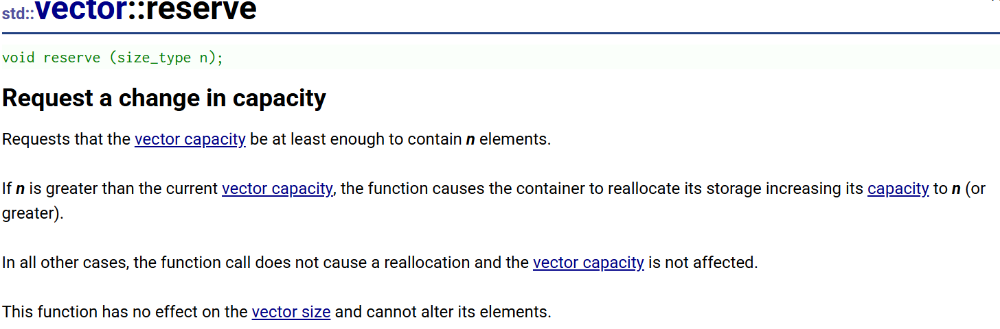
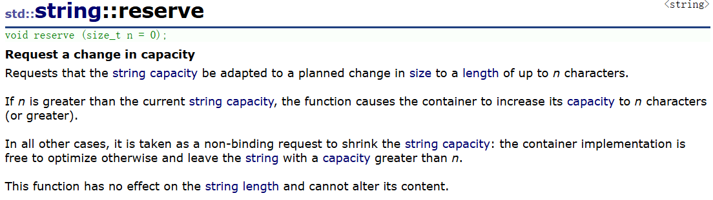
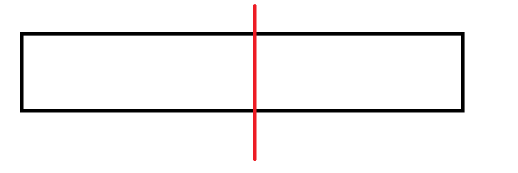
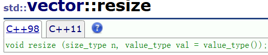
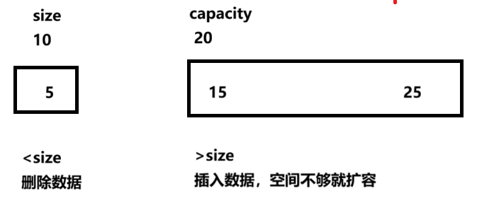
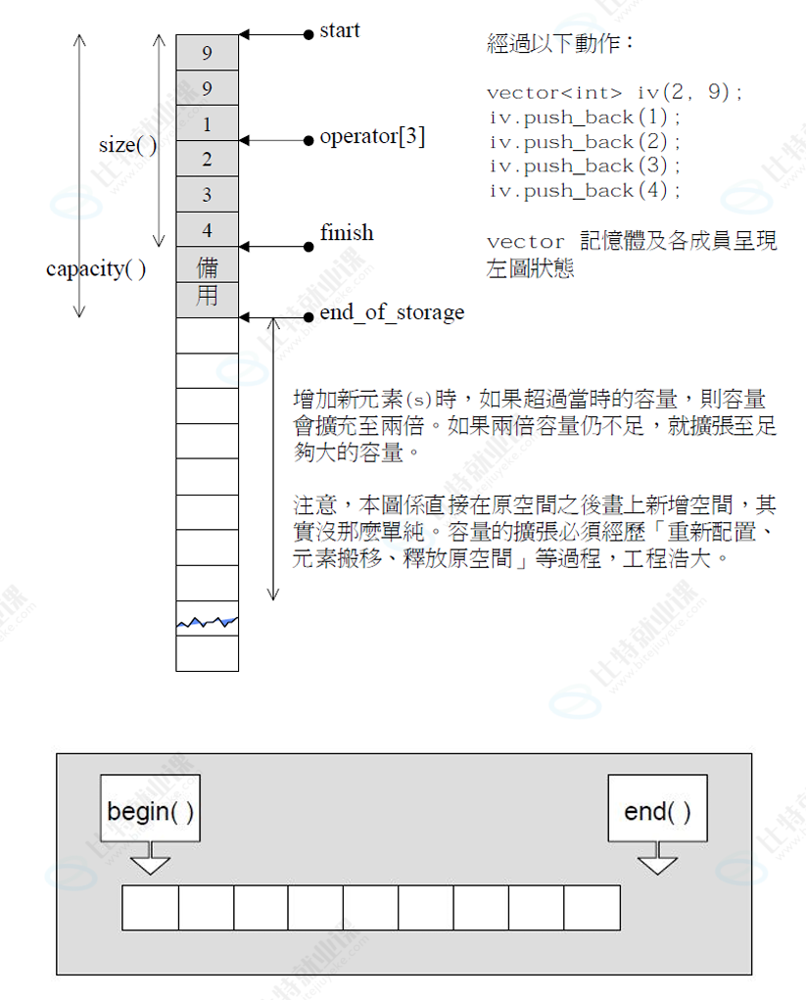

## vector

### 1.vector的介绍及使用

#### 1.1 vector的介绍 

>  [vector的文档介绍](http://www.cplusplus.com/reference/vector/vector/) 使用STL的三个境界：能用，明理，能扩展 ，那么下面学习vector，我们也是按照这个方法去学习


#### 1.2.1 vector的定义

```C++
void test1()
{
	vector<int> v1;
	vector<int> v2(10, 1); //10个1
	vector<int> v3(++v2.begin(), --v2.end());
	for (size_t i = 0; i < v3.size(); i++)
	{
		cout << v3[i] << endl;
	}
	cout << endl;

	vector<int>::iterator it = v3.begin();
	while (it != v3.end())
	{
		cout << *it << endl;
		++it;
	}
	cout << endl;
	
	for (auto e : v3)
	{
		cout << e << " ";
	}
	cout << endl;
}
```


#### 1.2.2 vector iterator的使用







#### 1.2.3 vector 空间增长问题


- capacity的代码在vs和g++下分别运行会发现，vs下capacity是按1.5倍增长的，g++是按2 倍增长的。这个问题经常会考察，不要固化的认为，vector增容都是2倍，具体增长多少是 根据具体的需求定义的。vs是PJ版本STL，g++是SGI版本STL。 
- reserve只负责开辟空间，如果确定知道需要用多少空间，reserve可以缓解vector增容的代 价缺陷问题。
- resize在开空间的同时还会进行初始化，影响size。

```C++
void TestVectorExpand()
{
	size_t sz;
	vector<int> v;
	sz = v.capacity();
	cout << "capacity changed: " << sz << '\n';
	cout << "moving v grow:\n";
	for (int i = 0; i < 100; i++)
	{
		v.push_back(i);
		if (sz != v.capacity())
		{
			sz = v.capacity();
			cout << "capacity changed: " << sz << '\n';
		}
	}
}
```






> 1. vector reserve 的n比capacity大时，可能会扩到n，也可以比n大
> 2. vector reserve 的n比capacity小时，不会缩容影响capacity
> 3. string reverse 的n比capacity小时，可能会缩容，但不会影响已存储的数据，最多缩到size

```C++
void test3()
{
	vector<int> v1(10, 1);
	v1.reserve(20);
	cout << v1.size() << endl;
	cout << v1.capacity() << endl;

	v1.reserve(15);
	cout << v1.size() << endl;
	cout << v1.capacity() << endl;

	v1.reserve(5);
	cout << v1.size() << endl;
	cout << v1.capacity() << endl;
}
```



> 释放内存不能说缩容先释放一半，从哪申请就从哪释放，只能一次释放完


#### resize







```C++
void test4()
{
	vector<int> v1(10, 1);
	v1.resize(20);
	cout << v1.size() << endl;
	cout << v1.capacity() << endl;

	v1.resize(15);
	cout << v1.size() << endl;
	cout << v1.capacity() << endl;

	v1.resize(5);
	cout << v1.size() << endl;
	cout << v1.capacity() << endl;
}
```


> 1. vector resize的n比size大时，会插入数据，空间不够就扩容
> 2. vector resize 的n比size小时，删除数据，一般不会缩容
> 3. 不传值就用默认构造函数


#### at 与 []

> [] 越界就发生断言
>
> at 越界抛异常

**vector不支持流插入、流提取**


#### vector<vector< int >>

```C++
// vector<vector<int>> 实际上要实例化出两个类
// vector<vector<int>> 与 vector<int> 实例化出两个类
template<class T>
class myvector
{
	T& operator[](int i)
	{
		assert(i > _size);
		return _a[i];
	}
private:
	T* _a;
	size_t _size;
	size_t _capacity;
};

////vector<int>
//class myvector
//{
//	T& operator[](int i)
//	{
//		assert(i > _size);
//		return _a[i];
//	}
//private:
//	T* _a;
//	size_t _size;
//	size_t _capacity;
//};

////vector<vector<int>>
//class myvector
//{
//	T& operator[](int i)
//	{
//		assert(i > _size);
//		return _a[i];
//	}
//private:
//	T* _a;
//	size_t _size;
//	size_t _capacity;
//};
```

  **vv\[2][1]** 实际上是调用了两个类的[] 等价于	 vv.operator\[](2).operator\[](1)


### 2.vector深度刨析及模拟实现




#### vector 迭代器失效问题

**迭代器的主要作用就是让算法能够不用关心底层数据结构，其底层实际就是一个指针，或者是对 指针进行了封装，比如：vector的迭代器就是原生态指针T* 。因此迭代器失效，实际就是迭代器 底层对应指针所指向的空间被销毁了，而使用一块已经被释放的空间，造成的后果是程序崩溃(即 如果继续使用已经失效的迭代器，程序可能会崩溃)**

> 几乎所有的容器erase之后，都会有迭代器失效，insert得看具体容器。string虽然也有迭代器失效问题，但是insert一般用下标版本，而不是迭代器版本 

​	对于vector可能会导致其迭代器失效的操作有： 

1. 会引起其底层空间改变的操作，都有可能是迭代器失效，比如：resize、reserve、insert、 assign、push_back等。

##### 野指针

> 扩容导致

```C++
#include <iostream>
using namespace std;
#include <vector>
int main()
{
    vector<int> v{1,2,3,4,5,6};
    auto it = v.begin();
    // 将有效元素个数增加到100个，多出的位置使用8填充，操作期间底层会扩容
    // v.resize(100, 8);
    // reserve的作用就是改变扩容大小但不改变有效元素个数，操作期间可能会引起底层容
    量改变
    // v.reserve(100);
    // 插入元素期间，可能会引起扩容，而导致原空间被释放
    // v.insert(v.begin(), 0);
    // v.push_back(8);
    // 给vector重新赋值，可能会引起底层容量改变
    v.assign(100, 8);
    /*
    出错原因：以上操作，都有可能会导致vector扩容，也就是说vector底层原理旧空间被释
    放掉，而在打印时，it还使用的是释放之间的旧空间，在对it迭代器操作时，实际操作的是一块
    已经被释放的空间，而引起代码运行时崩溃。
    解决方式：在以上操作完成之后，如果想要继续通过迭代器操作vector中的元素，只需给
    it重新赋值即可。
    */
    while(it != v.end())
    {
    cout<< *it << " " ;
    ++it;
    }
    cout<<endl;
    return 0;
}
```

##### 位置意义已经变了

> 因为你不知道vector什么时候扩容，因为不同平台不同编译器扩容机制不同


- 虽然没有扩容，但是由于数据挪动，迭代器的意义已经不同了，指向的数据不同，VS2019下会强制检查，访问会报错，Linux不会


2. 指定位置元素的删除操作--erase

```C++
#include <iostream>
using namespace std;
#include <vector>
int main()
{
    int a[] = { 1, 2, 3, 4 };
    vector<int> v(a, a + sizeof(a) / sizeof(int));
    // 使用find查找3所在位置的iterator
    vector<int>::iterator pos = find(v.begin(), v.end(), 3);
    // 删除pos位置的数据，导致pos迭代器失效。
    v.erase(pos);
    cout << *pos << endl; // 此处会导致非法访问
    return 0;
}
```

erase删除pos位置元素后，pos位置之后的元素会往前搬移，没有导致底层空间的改变，理 论上讲迭代器不应该会失效，但是：如果pos刚好是最后一个元素，删完之后pos刚好是end 的位置，而end位置是没有元素的，那么pos就失效了。因此删除vector中任意位置上元素 时，vs就认为该位置迭代器失效了。 

以下代码的功能是删除vector中所有的偶数，请问那个代码是正确的，为什么？

```C++
#include <iostream>
using namespace std;
#include <vector>
int main()
{
    vector<int> v{ 1, 2, 3, 4 };
    auto it = v.begin();
    while (it != v.end())
    {
        if (*it % 2 == 0)
            v.erase(it);
        ++it;
    }
    
    return 0;
}
int main()
{
    vector<int> v{ 1, 2, 3, 4 };
    auto it = v.begin();
    while (it != v.end())
    {
        if (*it % 2 == 0)
            it = v.erase(it);
        else
            ++it;
    }
    return 0;
}
```

3. 注意：Linux下，g++编译器对迭代器失效的检测并不是非常严格，处理也没有vs下极端。

```C++
// 1. 扩容之后，迭代器已经失效了，程序虽然可以运行，但是运行结果已经不对了
int main()
{
    vector<int> v{1,2,3,4,5};
    for(size_t i = 0; i < v.size(); ++i)
    cout << v[i] << " ";
    cout << endl;
    auto it = v.begin();
    cout << "扩容之前，vector的容量为: " << v.capacity() << endl;
    // 通过reserve将底层空间设置为100，目的是为了让vector的迭代器失效    
    v.reserve(100);
    cout << "扩容之后，vector的容量为: " << v.capacity() << endl;
    // 经过上述reserve之后，it迭代器肯定会失效，在vs下程序就直接崩溃了，但是linux下不会
    // 虽然可能运行，但是输出的结果是不对的
    while(it != v.end())
    {
        cout << *it << " ";
        ++it;
    }
    cout << endl;
    return 0;
}

程序输出：
1 2 3 4 5 
扩容之前，vector的容量为: 5
扩容之后，vector的容量为: 100
0 2 3 4 5 409 1 2 3 4 5
// 2. erase删除任意位置代码后，linux下迭代器并没有失效
// 因为空间还是原来的空间，后序元素往前搬移了，it的位置还是有效的
    
#include <vector>
#include <algorithm>
int main()
{
    vector<int> v{1,2,3,4,5};
    vector<int>::iterator it = find(v.begin(), v.end(), 3);
    v.erase(it);
    cout << *it << endl;
    while(it != v.end())
    {
        cout << *it << " ";
        ++it;
    }
    cout << endl;
    return 0;
}
程序可以正常运行，并打印：
4
4 5
// 3: erase删除的迭代器如果是最后一个元素，删除之后it已经超过end
// 此时迭代器是无效的，++it导致程序崩溃
int main()
{
    vector<int> v{1,2,3,4,5};
    // vector<int> v{1,2,3,4,5,6};
    auto it = v.begin();
    while(it != v.end())
    {
        if(*it % 2 == 0)
        v.erase(it);
        ++it;
    }
    for(auto e : v)
        cout << e << " ";
    cout << endl;
    return 0;
}
========================================================
// 使用第一组数据时，程序可以运行
[sly@VM-0-3-centos 20220114]$ g++ testVector.cpp -std=c++11
[sly@VM-0-3-centos 20220114]$ ./a.out
1 3 5 
=========================================================
// 使用第二组数据时，程序最终会崩溃
$ vim testVector.cpp 
$ g++ testVector.cpp -std=c++11
$ ./a.out
Segmentation fault
```

从上述三个例子中可以看到：SGI STL中，迭代器失效后，代码并不一定会崩溃，但是运行 结果肯定不对，如果it不在begin和end范围内，肯定会崩溃的。

4. 与vector类似，string在插入+扩容操作+erase之后，迭代器也会失效

```C++
#include <string>
void TestString()
{
    string s("hello");
    auto it = s.begin();
    // 放开之后代码会崩溃，因为resize到20会string会进行扩容
    // 扩容之后，it指向之前旧空间已经被释放了，该迭代器就失效了
    // 后序打印时，再访问it指向的空间程序就会崩溃
    //s.resize(20, '!');
    while (it != s.end())
    {
        cout << *it;
        ++it;
    }
    cout << endl;
    it = s.begin();
    while (it != s.end())
     {
        it = s.erase(it);
        // 按照下面方式写，运行时程序会崩溃，因为erase(it)之后
        // it位置的迭代器就失效了
        // s.erase(it);  
        ++it;
    }
}
```

迭代器失效解决办法：在使用前，对迭代器重新赋值即可。


#### vector模拟实现

##### 使用memcpy拷贝问题 

 假设模拟实现的vector中的reserve接口中，使用memcpy进行的拷贝，以下代码会发生什么问 题？ 

```C++
int main()
{
    zhutian::vector<bite::string> v;
    v.push_back("1111");
    v.push_back("2222");
    v.push_back("3333");
    return 0;
}
```


问题分析：

1. memcpy是内存的二进制格式拷贝，将一段内存空间中内容原封不动的拷贝到另外一段内存 空间中
2. 如果拷贝的是自定义类型的元素，memcpy既高效又不会出错，但如果拷贝的是自定义类型 元素，并且自定义类型元素中涉及到资源管理时，就会出错，因为memcpy的拷贝实际是浅 拷贝


结论：如果对象中涉及到资源管理时，千万不能使用memcpy进行对象之间的拷贝，因为 memcpy是浅拷贝，否则可能会引起内存泄漏甚至程序崩溃

```C++
#pragma once
#include <memory>
#include <iostream>
#include <list>
#include <string>
#include <assert.h>

namespace zhutian
{
	template<class T>
	class vector
	{
	public:
		typedef T* iterator;
		typedef const T* const_iterator;

		//vector()
		//{ }

		//C++11 强制生成默认构造函数
		vector() = default;

		vector(const vector<T>& v)
		{
			//提前开好空间减少扩容消耗
			reserve(v.size());
			//& 防止是string之类的
			for (auto& e : v)
			{
				push_back(e);
			}
		}

		//
		template<class InputIterator>
		vector(InputIterator first, InputIterator last)
		{
			// 这里不能用<=，对于vector可以，但是对于链表等不连续的空间就不行
			while (first != last)
			{
				push_back(*first);
				++first;
			}
		}

		vector(size_t n, const T& val=T())
		{
			reserve(n);
			for (size_t i = 0; i < n; i++)
			{
				push_back(val);
			}
		}

		vector(int n, const T& val = T())
		{
			reserve(n);
			for (int i = 0; i < n; i++)
			{
				push_back(val);
			}
		}

		void reserve(size_t n)
		{
			if (n > capacity())
			{
				size_t old_size = size();
				T* tmp = new T[n];
				
				// 会导致像vector<string> vector<vector<int>>这样的在扩容时出错
				//memcpy(tmp, _start, size() * sizeof(T));
				for (size_t i = 0; i < old_size; i++)
				{
					tmp[i] = _start[i];
				}

				delete[] _start;
				_start = tmp;
				_finish = _start + old_size;
				_end_of_storage = _start + n;
			}
		}

		iterator begin()
		{
			return _start;
		}

		iterator end()
		{
			return _finish;
		}

		const_iterator begin()const
		{
			return _start;
		}

		const_iterator end()const
		{
			return _finish;
		}

		size_t size()const
		{
			return _finish - _start;
		}

		size_t capacity()const
		{
			return _end_of_storage - _start;
		}

		void push_back(const T& x)
		{
			// 扩容
			if (_finish == _end_of_storage)
			{
				reserve(size() != 0 ? capacity() * 2 : 4);
			}
			*_finish = x;
			++_finish; 
		}

		T& operator[](size_t i)
		{
			assert(i < size());
			return _start[i];
		}


		const T& operator[](size_t i)const
		{
			assert(i < size());
			return _start[i];
		}

		bool empty()
		{
			return _start == _finish;
		}

		// 迭代器失效
		//void insert(iterator pos, const T& x)
		//{
		//	// 扩容
		//	if (_finish == _end_of_storage)
		//	{
		//		reserve(size() != 0 ? capacity() * 2 : 4);
		//	}

		//	iterator end = _finish - 1;
		//	while (end >= pos)
		//	{
		//		*(end + 1) = *end;
		//		--end;
		//	}
		//	*pos = x;
		//	++_finish;
		//}

		// 不能加引用,加引用find、范围for、insert等就不支持了,而且
		//iterator insert(iterator& pos, const T& x)
		iterator insert(iterator pos, const T& x)
		{
			assert(pos >= _start );
			assert(pos <= _finish);

			// 扩容
			if (_finish == _end_of_storage)
			{
				size_t len = pos - _start;
				reserve(size() != 0 ? capacity() * 2 : 4);
				pos = _start + len;
			}

			iterator end = _finish - 1;
			while (end >= pos)
			{
				*(end + 1) = *end;
				--end;
			}
			*pos = x;
			++_finish;
			return pos;
		}

		void resize(size_t n, T val = T())
		{
			if (n < size())
			{
				_finish = _start +n;
			}
			else
			{
				reserve(n);
				while (_finish < _start + n)
				{
					*_finish = val;
					++_finish;
				}
			}
		}

		iterator erase(iterator pos)
		{
			assert(pos >= _start);
			assert(pos < _finish);

			iterator it = pos + 1;
			while (it != end())
			{
				*(it - 1) = *it;
				it++;
			}
			--_finish;
			return pos;
		}

		void pop_back()
		{
			assert(!empty());
			--_finish;
		}

		void clear()
		{
			_finish = _start;
		}

		void swap(vector<T>& v)
		{
			std::swap(_start, v._start);
			std::swap(_finish, v._finish);
			std::swap(_end_of_storage, v._end_of_storage);
		}

		// 类里面可以用类名替代类型，类外不行
		//vector<T>& operator=(vector<T> v)
		vector& operator=(vector v)
		{
			swap(v);
			return *this;
		}

		//// v1=v3
		//vector<T>& operator=(const vector<T>& v)
		//{
		//	if (this != &v)
		//	{
		//		clear();
		//		reserve(v.size());
		//		for (auto& e : v)
		//		{
		//			push_back(e);
		//		}
		//	}
		//	return *this;
		//}

		~vector()
		{
			if (_start)
			{
				delete[] _start;
				_start = _finish = _end_of_storage = nullptr;
			}
		}


	private:
		iterator _start = nullptr;
		iterator _finish = nullptr;
		iterator _end_of_storage = nullptr;
	};

	template<class container>
	void print_vector(const container& v)
	{
		// 类名::名称 可能是类中的某个类型，也有可能是类静态成员
		// 规定：没有实例化的类模板里取东西，编译器不能区分这里的
		// const_iterator是类型还是静态变量
		// 这个时候在前面加一个typename就可以告诉编译器是类型
		// 这也是typename在模板template<class T>与template<typename T>一样
		// 但是class与typename不同
		// vector<T>::const_iterator it = v.begin();

		// 这里用auto更方便
		//typename vector<T>::const_iterator it = v.begin();
		auto it = v.begin();

		while (it != v.end())
		{
			std::cout << *it << " ";
			++it;
		}
		std::cout << std::endl;

		for (auto e : v)
		{
			std::cout << e << " ";
		}
		std::cout << std::endl;
	}

	void teat_vector()
	{
		vector<int> v;
		v.push_back(1);
		v.push_back(2);
		v.push_back(3);
		v.push_back(4);
		v.push_back(5);

		//for (size_t i = 0; i < v.size(); i++)
		//{
		//	std::cout << v[i] << " ";
		//}
		//std::cout << std::endl;

		print_vector(v);
		for (size_t i = 0; i < v.size(); i++)
		{
			std::cout << v[i] << " ";
		}
		std::cout << std::endl;

		vector<double> vd;
		vd.push_back(1.1);
		vd.push_back(2.2);
		vd.push_back(3.3);
		vd.push_back(4.4);
		vd.push_back(5.5);
		print_vector(vd);
	}

	void teat_vector2()
	{
		vector<int> v;
		v.push_back(1);
		v.push_back(2);
		v.push_back(3);
		v.push_back(4);
		v.push_back(5);

		print_vector(v);

		//v.insert(v.begin() + 2, 30) ;

		//print_vector(v);
		std::cout << v.capacity() << std::endl;

		int x;
		std::cin >> x;
		auto pos = std::find(v.begin(), v.end(), x);
		if (pos != v.end())
		{
			// insert以后,迭代器pos就失效了,不要直接访问,要访问就要更新这个迭代器的值
			/*v.insert(pos, 40);
			(*pos)*=10;*/
			v.insert(pos, 40);

			std::cout << v.capacity() << std::endl;
			//pos=v.insert(pos, 40);
			*(pos+1) *= 10;
		}
		print_vector(v);

	}


	void teat_vector3()
	{
		//std::vector<int> v;
		vector<int> v;
		v.push_back(1);
		v.push_back(2);
		v.push_back(3);
		v.push_back(4);
		v.push_back(4);
		v.push_back(5);

		print_vector(v);

		//auto it = v.begin();
		////删除所有的偶数
		//while (it != v.end())
		//{
		//	if (*it % 2 == 0)
		//	{
		//		v.erase(it);
		//	}
		//	++it;
		//}
		//print_vector(v);

		auto it = v.begin();
		//删除所有的偶数
		while (it != v.end())
		{
			if (*it % 2 == 0)
			{
				it=v.erase(it);
			}
			else
			{
				++it;
			}
		}
		print_vector(v);

	}

	void teat_vector4()
	{
		int i = int();
		int j = int(1);
		int z(2);

		vector<int> v;
		v.resize(10, 1);
		v.reserve(20);
		print_vector(v);
		cout << v.size() << endl;
		cout << v.capacity() << endl;

		v.resize(15, 2);
		print_vector(v);
		cout << v.size() << endl;
		cout << v.capacity() << endl;

		v.resize(25, 3);
		print_vector(v);
		cout << v.size() << endl;
		cout << v.capacity() << endl;

		v.resize(5, 4);
		print_vector(v);
		cout << v.size() << endl;
		cout << v.capacity() << endl;
	}

	void teat_vector5()
	{
		vector<int> v;
		v.push_back(1);
		v.push_back(2);
		v.push_back(3);
		v.push_back(4);
		v.push_back(5);
		print_vector(v);

		vector<int> v1 = v;
		print_vector(v1);

		vector<int> v2 ;
		v2.push_back(10);
		v2.push_back(20);
		v2.push_back(30);
		print_vector(v2);

		v = v2;
		print_vector(v);
		print_vector(v2);

	}

	void teat_vector6()
	{
		vector<int> v1;
		v1.push_back(1);
		v1.push_back(2);
		v1.push_back(3);
		v1.push_back(4);
		v1.push_back(5);
		print_vector(v1);


		vector<int> v2(v1.begin(), v1.begin() +3);
		print_vector(v2);

		// 可以用别的容器迭代器初始化，所以迭代器区间初始化函数写为模板函数
		// 要求类型是匹配的,int 与 int ，string 与 string
		std::list<int>  lt;
		lt.push_back(10);
		lt.push_back(10);
		lt.push_back(10);
		vector<int> v3(lt.begin(), lt.end());
		print_vector(lt);
		print_vector(v3);

		vector<std::string> v4(5, "101010");
		print_vector(v4);

		vector<std::string> v5(5);
		print_vector(v5);

		vector<int> v6(5, 1);
		print_vector(v6);

		//vector<int> v7(5u,1);
		//print_vector(v7);

		vector<int> v8(5, 1);
		print_vector(v8);
	}


	void teat_vector7()
	{
		vector<string> v1;
		v1.push_back("1111111");
		v1.push_back("1111111");
		v1.push_back("1111111");
		v1.push_back("1111111");
		v1.push_back("1111111");
		print_vector(v1);

		v1.push_back("1111111");
		print_vector(v1);
	}
}
```

