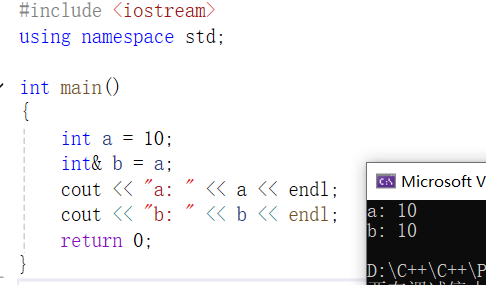
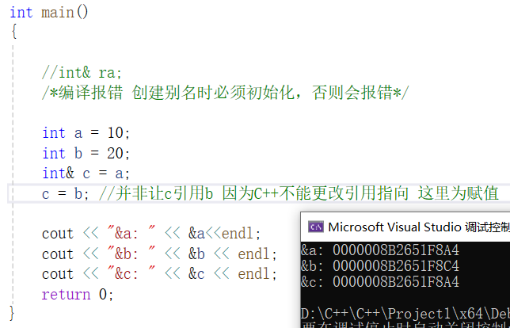
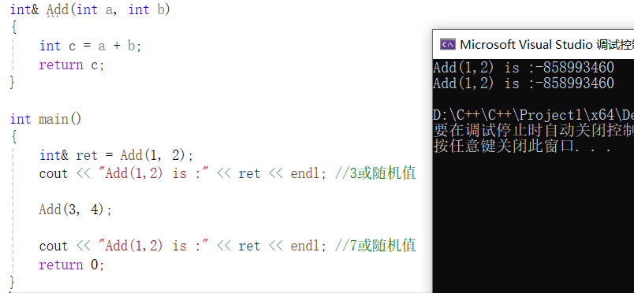
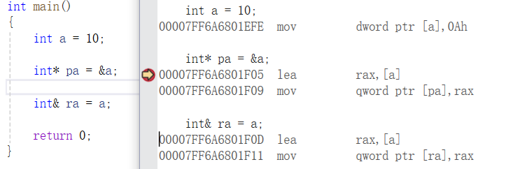

## C++引用

### 概念

​	C++中的引用就是给变量取别名，语法上说编译器不会为引用另外开辟空间，引用与原变量指向同一空间

​	**变量类型& 引用别名=引用变量**





​	也可以给别名再取别名，指向的还是原来的那个变量，可以看出地址都是一样的


### 引用的特性

- 引用在定义时必须初始化
- 一个变量可以有多个引用
- 引用一旦引用一个实体，再不能引用其他实体





### 引用的使用

- 引用主要是用于引用传参和引用做返回值，以减少拷贝提高效率和改变引用对象时同时改变被引用对象
- 引用传参跟指针传参功能是类似的，引用传参相对更方便一些
- 引用和指针在实践中相辅相成，功能有重叠性，但是各有特点，互相不可替代。C++的引用跟其他语言的引用（如Java）是有很大的区别 。除了用法，最大的点，C++引用定义后不能改变指向，Java的引用可以改变指向。
- 一些主要用C代码实现版本的数据结构教材中，使用C++引用替代指针传参，目的是简化程序，避开复杂的指针


```C++
void Swap(int& x, int& y)
{
	int temp = x;
	x = y;
	y = temp;
}

int main()
{
	int x = 10;
	int y = 20;
	cout << "x: " << x << endl;
	cout << "y: " << y << endl;

	Swap(x, y);

	cout << "x: " << x << endl;
	cout << "y: " << y << endl;
	return 0;
}

输出：
x: 10
y: 20
x: 20
y: 10
```


### const引用

- 可以引用一个const对象，但是必须用const引用。const引用也可以引用普通对象，因为对象的访问权限在引用过程中可以缩小，但是不能放大。
- 需要注意的是类似`int& rb=a*3;` `double d=3.14; int& rd=d;` 这样的场景下a*3的结果保存在一个临时对象中，`int& rd=d`也是类似，在类型转换中会产生临时对象存储中间值，也就是，rb和rd引用的都是临时对象，而C++规定临时对象具有常性，所以这里就触发了权限放大，必须要用常引用才可以。
- 所谓临时对象就是编译器需要一个空间暂存表达式的求值结果时临时创建的一个未命名对象，C++中把这个未命名对象叫做临时对象。

```
int main()
{
	const int a = 10;
	// 编译报错：error C2440: “初始化”: 无法从“const int”转换为“int &”
	// 这里的引用是对a访问权限的放大
	//int& ra = a;

	const int& ra = a;

	//编译报错：error C3892: “ra”: 不能给常量赋值
	//ra++;

	//这里的引用是对b访问权限的缩小
	int b = 20;
	const int& rb = b;

	//编译报错 error C3892: “rb”: 不能给常量赋值
	//rb++;

	return 0;
}
```

```
int main()
{
	int a = 10;

	const int& ra = 30;

	//编译报错：error C2440: “初始化”: 无法从“int”转换为“int &”
	//int& rb = a * 3;
	const int& rb = a * 3;

	double d = 3.14;

	//编译报错：error C2440: “初始化”: 无法从“double”转换为“int &”
	//int& rd = d;

	const int& rd = d;

	return 0;
}
```


### 返回引用值

- 当返回值为引用时，务必注意返回的变量是否为临时变量。若为临时变量，在后续的使用中，就会造成类似野指针的后果




### 指针和引用的关系

C++中指针与引用相辅相成，功能有重叠性，但各有自己的特点，互相不可替代。

- 语法概念上，引用是一个变量的取别名不开空间，指针是存储一个变量地址，要开空间。
- 引用在定义时必须初始化，指针建议初始化，但语法上不是必须的。
- 引用在初始化时引用一个对象后，就不能再引用其他对象；而指针可以不断地改变指向对象。
- 引用可以直接访问指向对象，指针需要解引用才是访问指向对象。
- sizeof中含义不同，引用结果为引用类型的大小，但指针始终是地址空间所占字节个数（32位平台下占4byte ，64位下是8byte）
- 指针很容易出行空指针和野指针的问题，引用很少出现，引用使用起来相对更安全一些。




> 实际上，我们从反汇编的层面看，引用底层也是采用指针的形式实现的，并且也需要开辟空间，但我们从语法上认为引用不需要额外开辟空间
