## 类与对象

### this指针

- 实际上类内函数的第一个参数为隐藏的形参this指针
- this指针不能显示的写实参和形参`void Print(Date* const this)` `d1.Print(&d1)` ,但是可以显示的使用如`this->_year`
- 类的成员函数中访问成员变量，本质都是通过this指针访问的，如Init函数中给_year赋值，`this->_year=year;` 


```C++
class Date
{
public:
    void Init(int year, int month, int day)
    {
        _year = year;
        _month = month;
        _day = day;
    }

    // void Print(Date* this)
    void Print()
    {
        //this=nullptr;
        //cout <<this-> _year << "-" <<this-> _month << "-" <<this-> _day << endl;
        cout << _year << "-" << _month << "-" << _day << endl;
    }
private:
    // 为了区分成员变量，⼀般习惯上成员变量
    //   会加⼀个特殊标识，如_或者m开头
    int _year; // year_  m_year
    int _month;
    int _day;
};

int main()
{
    Date d1;
    d1.Init(2024, 3, 31);
	return 0;
}
```


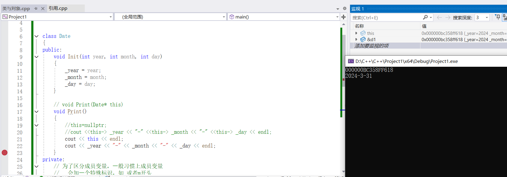


**[面试题]**

1. this指针存在内存哪个区域的() A. 栈 B.堆 C.静态区 D.常量区 E.对象⾥⾯

​	通过sizeof大小可以得知，this指针一定不存在对象中。事实上this指针是一个形参，是一个临时变量，存储在栈帧上的。由下图可知，事实上是用寄存器传的。而真的要传参是要push压栈，用寄存器是因为CPU在访问时，因为内存不够快，this又小，且需要经常访问，所以会存在CPU的寄存器中，可以快速访问。（根据编译器不同而不同）

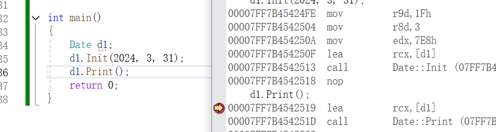

2.下⾯程序编译运⾏结果是（） A、编译报错 B、运⾏崩溃 C、正常运⾏

```C++
class A
{
public:
	void Print()
	{
		cout << "A::Print()" << endl;
	}
private:
	int _a;
};

int main()
{
	A* p = nullptr;
	p->Print();
	return 0;
}
```

事实上，这题可以正常运行，选C

 成员函数的地址不在对象中，成员变量是存在对象中的，所以这里的Print()并没有解引用，所以不存在空指针的问题，从汇编来看，也只是把p给了寄存器，但没有操作

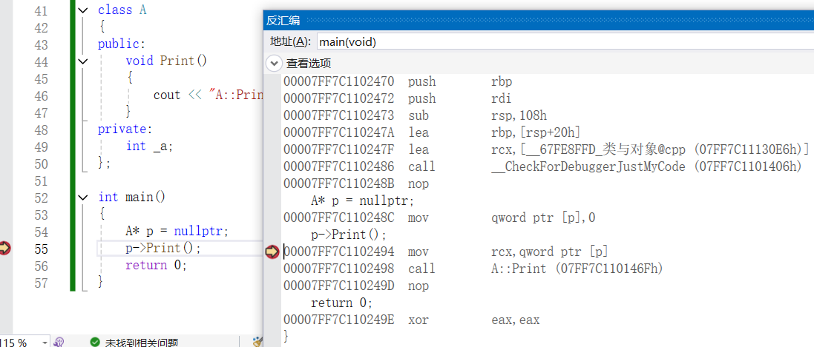


如果更改代码

```C++
class A
{
public:
	void Print()
	{
		cout << "A::Print()" << endl;
	}
//private:
	int _a;
};

int main()
{
	A* p = nullptr;
	p->Print();
	p->_a;
	return 0;
}
```


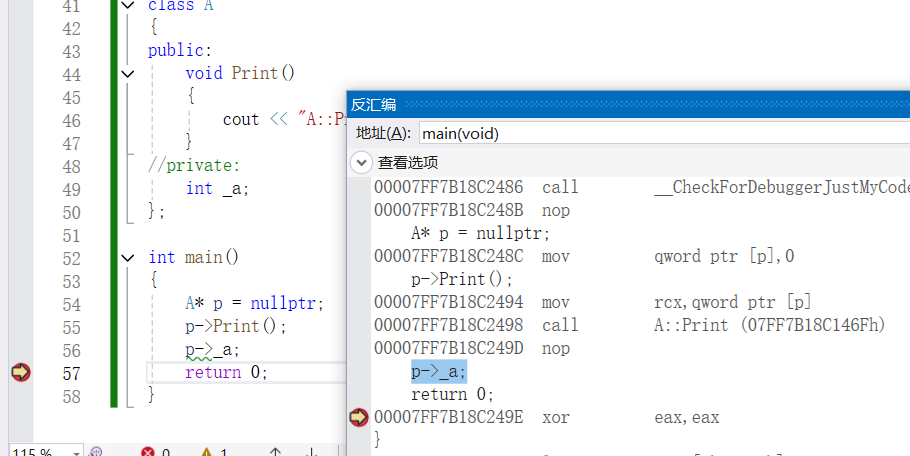

同样不会报错，从汇编的角度看，因为我们虽然写了p->_a;但实际上并没有使用，编译器会认为这是个无意义的语句，在编译时将他优化掉了，也可以看到p->_a；并没有生成对应的汇编语句

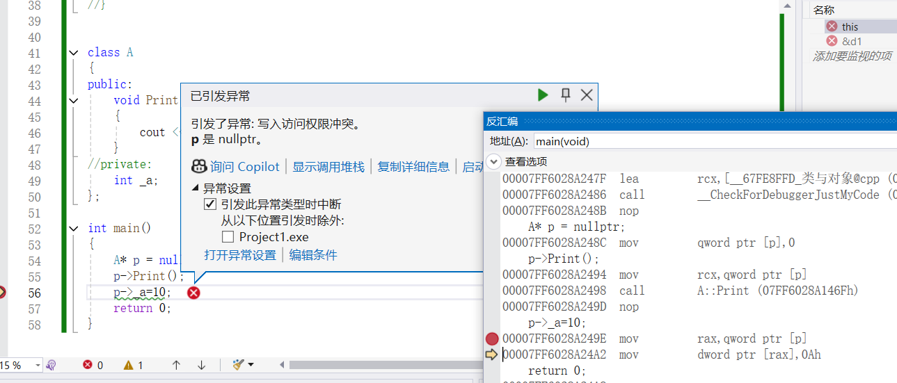

而如果写了使用，就会发生报错了


3.下⾯程序编译运⾏结果是（） A、编译报错 B、运⾏崩溃 C、正常运⾏

```C++
#include<iostream>
 using namespace std;
 class A
 {
 public:
	 void Print()
     {
         cout << "A::Print()" << endl;
         cout << _a << endl;
     }
 private:
     int _a;
 };
 int main()
 {
     A* p = nullptr;
     p->Print();
     return 0;
 }
```

这里选b，因为这里实际访问了_a,通过this->a,解引用了空指针，就会崩溃

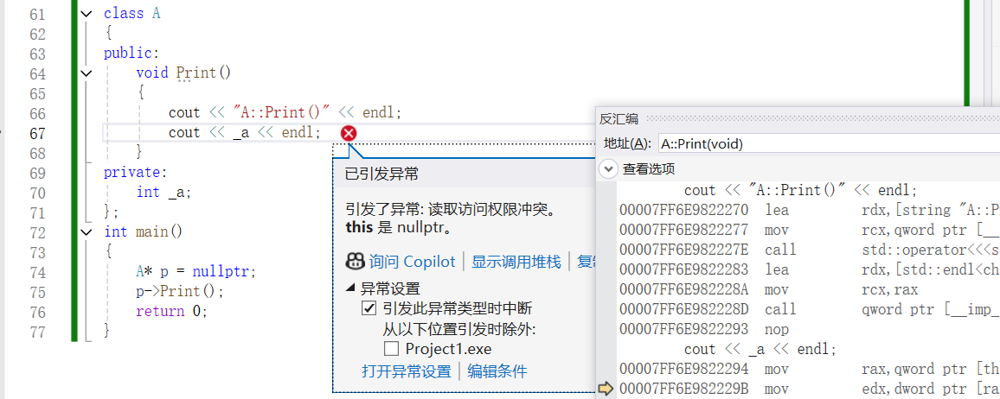

### 声明与定义

---

- 类的只是声明，类中的成员变量也是声明，不开空间
- 只有生成对象，如`Date d1`才会实例化出对象，为成员变量开辟空间

```C++
class Date
{
public:
    void Init(int year, int month, int day)
    {
        _year = year;
        _month = month;
        _day = day;
    }

    // void Print(Date* this)
    void Print()
    {
        cout << _year << "-" << _month << "-" << _day << endl;
    }
private:
    // 为了区分成员变量，⼀般习惯上成员变量
    //   会加⼀个特殊标识，如_或者m开头
    int _year; // year_  m_year
    int _month;
    int _day;
};

int main()
{
    Date d1;
    d1.Init(2024, 3, 31);
	return 0;
}
```


### 类的6个默认成员函数

---

默认成员函数就是⽤⼾没有显式实现，编译器会⾃动⽣成的成员函数称为默认成员函数。⼀个类，我 们不写的情况下编译器会默认⽣成以下6个默认成员函数，需要注意的是这6个中最重要的是前4个，最 后两个取地址重载不重要，我们稍微了解⼀下即可。其次就是C++11以后还会增加两个默认成员函数， 移动构造和移动赋值，这个我们后⾯再讲解。默认成员函数很重要，也⽐较复杂，我们要从两个⽅⾯ 去学习：

- 第⼀：我们不写时，编译器默认⽣成的函数⾏为是什么，是否满⾜我们的需求。 
- 第⼆：编译器默认⽣成的函数不满⾜我们的需求，我们需要⾃⼰实现，那么如何⾃⼰实现？


### 构造函数

---

构造函数是特殊的成员函数，需要注意的是，构造函数虽然名称叫构造，但是构造函数的主要任务并 不是开空间创建对象(我们常使⽤的局部对象是栈帧创建时，空间就开好了)，⽽是对象实例化时初始化 对象。构造函数的本质是要替代我们以前Stack和Date类中写的Init函数的功能，构造函数⾃动调⽤的 特点就完美的替代的了Init。

 **构造函数的特点：** 

1. 函数名与类名相同。 

2. ⽆返回值。(返回值啥都不需要给，也不需要写void，不要纠结，C++规定如此)

3. 对象实例化时系统会**⾃动调⽤**对应的构造函数。 

4. 构造函数可以重载。 

5. 如果类中没有显式定义构造函数，则C++编译器会⾃动⽣成⼀个⽆参的默认构造函数，⼀旦⽤⼾显 式定义编译器将不再⽣成。 

6. ⽆参构造函数、全缺省构造函数、我们不写构造时编译器默认⽣成的构造函数，都叫做默认构造函 数。但是这三个函数有且只有⼀个存在，不能同时存在。⽆参构造函数和全缺省构造函数虽然构成 函数重载，但是调⽤时会存在歧义。要注意很多同学会认为默认构造函数是编译器默认⽣成那个叫 默认构造，实际上⽆参构造函数、全缺省构造函数也是默认构造，总结⼀下就是不传实参就可以调 ⽤的构造就叫默认构造。

7. 我们不写，编译器默认⽣成的构造，对内置类型成员变量的初始化没有要求，也就是说是是否初始 化是不确定的，看编译器。对于⾃定义类型成员变量，要求调⽤这个成员变量的默认构造函数初始 化。如果这个成员变量，没有默认构造函数，那么就会报错，我们要初始化这个成员变量，需要⽤ 初始化列表才能解决。

   


说明：C++把类型分成内置类型(基本类型)和⾃定义类型。内置类型就是语⾔提供的原⽣数据类型， 如：int/char/double/指针等，⾃定义类型就是我们使⽤class/struct等关键字⾃⼰定义的类型。

```C++
class Date
{
public:
	// 1.⽆参构造函数
	Date()
	{
		_year = 1;
		_month = 1;
		_day = 1;
	}
	// 2.带参构造函数

	Date(int year, int month, int day)
	{
		_year = year;
		_month = month;
		_day = day;
	}

	// 3.全缺省构造函数 
	// 全缺省函数与默认构造函数Date()构成重载，但是不能同时存在，无参调用存在歧义
	/*Date(int year = 1, int month = 1, int day = 1)
	{
	_year = year;
	_month = month;
	_day = day;
	}*/

	void Print()
	{
		cout << _year << "/" << _month << "/" << _day << endl;
	 }	
 private:
	 int _year;
	 int _month;
	 int _day;
 };
 int main()
 {
	 //  如果留下三个构造中的第⼆个带参构造，第⼀个和第三个注释掉
	 // 编译报错： error C2512 : “Date”:没有合适的默认构造函数可⽤
	 Date d1; //注意这里不能加() Date d1() 因为这会跟函数的声明分不开 如Date f();
	 // 调⽤默认构造函数
	 Date d2(2025, 1, 1); // 调⽤带参的构造函数
	 // 注意：如果通过⽆参构造函数创建对象时，对象后⾯不⽤跟括号，否则编译器⽆法
	 // 区分这⾥是函数声明还是实例化对象
	 // warning C4930: “Date d3(void)”: 未调⽤原型函数(是否是有意⽤变量定义的 ? )
	 Date d3();
	 d1.Print();
	 d2.Print();
	 return 0;
 }

```


**默认生成的构造函数**

- 我们不写编译器默认生成的那个构造函数叫默认构造
- 无参构造函数也可以叫默认构造
- 全缺省也可以叫默认构造
- 可以不传参数就调用构造，都可以叫默认构造

默认生成构造函数：内置类型成员不做处理（看编译器，建议当成不处理），自定义类型会去调他的构造函数

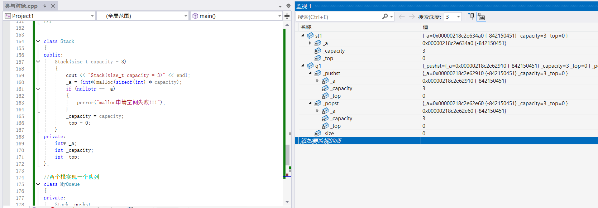

```C++

class Date
{
public:
	void Print()
	{
		cout << _year << "/" << _month << "/" << _day << endl;
	}
private:
    //C++11支持，声明时给缺省值，并没有开辟空间实例化
	int _year=1;
	int _month=1;
	int _day=1;
};

class Stack
{
public:
	Stack(size_t capacity = 3)
	{
		cout << "Stack(size_t capacity = 3)" << endl;
		_a = (int*)malloc(sizeof(int) * capacity);
		if (nullptr == _a)
		{
			perror("malloc申请空间失败!!!");
		}
		_capacity = capacity;
		_top = 0;
	}
private:
	int* _a;
	int _capacity;
	int _top;
};

//两个栈实现一个队列
class MyQueue
{
private:
	Stack _pushst;
	Stack _popst;
	int _size;
};

int main()
{
	Date d1; 
	d1.Print();

	Stack st1;

	MyQueue q1;

	return 0;
}
```


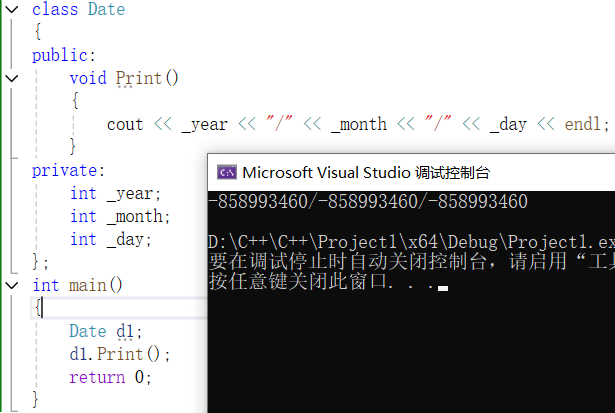

**总结**

- 一般情况下，我们都要自己写构造函数
- 成员都是自定义类型，或者声明时给了缺省值可以考虑让编译器自己生成构造函数


### 析构函数

析构函数与构造函数功能相反，析构函数不是完成对对象本⾝的销毁，⽐如局部对象是存在栈帧的， 函数结束栈帧销毁，他就释放了，不需要我们管，C++规定对象在销毁时会⾃动调⽤析构函数，完成对 象中资源的清理释放⼯作。析构函数的功能类⽐我们之前Stack实现的Destroy功能，⽽像Date没有 Destroy，其实就是没有资源需要释放，所以严格说Date是不需要析构函数的。 析构函数的特点： 

1. 析构函数名是在类名前加上字符~。 
2. ⽆参数⽆返回值。(这⾥跟构造类似，也不需要加void 
3. ⼀个类只能有⼀个析构函数。若未显式定义，系统会⾃动⽣成默认的析构函数。 
4. 对象⽣命周期结束时，系统会⾃动调⽤析构函数。 
5. 跟构造函数类似，我们不写编译器⾃动⽣成的析构函数对内置类型成员不做处理，⾃定类型成员会 调⽤他的析构函数。 
6. 还需要注意的是我们显⽰写析构函数，对于⾃定义类型成员也会调⽤他的析构，也就是说⾃定义类 型成员⽆论什么情况都会⾃动调⽤析构函数。 
7. 如果类中没有申请资源时，析构函数可以不写，直接使⽤编译器⽣成的默认析构函数，如Date；如 果默认⽣成的析构就可以⽤，也就不需要显⽰写析构，如MyQueue；但是有资源申请时，⼀定要 ⾃⼰写析构，否则会造成资源泄漏，如Stack。
8. ⼀个局部域的多个对象，C++规定后定义的先析构。


```C++
class Date
{
public:
	void Print()
	{
		cout << _year << "/" << _month << "/" << _day << endl;
	}

	~Date()
	{
		//日期类严格说不需要写构造函数
		cout << "~Date()" << endl;
	}
private:
	int _year;
	int _month;
	int _day;
};
int main()
{
	Date d1; 
	//d1.Print();
	return 0;
}
```

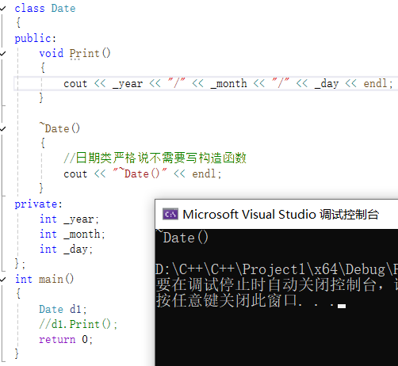

```C++
class Date
{
public:
	void Print()
	{
		cout << _year << "/" << _month << "/" << _day << endl;
	}

	~Date()
	{
		//日期类严格说不需要写构造函数
		cout << "~Date()" << endl;
	}
private:
	int _year;
	int _month;
	int _day;
};


class Stack
{
public:
	Stack(size_t capacity = 3)
	{
		cout << "Stack(size_t capacity = 3)" << endl;
		_a = (int*)malloc(sizeof(int) * capacity);
		if (nullptr == _a)
		{
			perror("malloc申请空间失败!!!");
		}
		_capacity = capacity;
		_top = 0;
	}

	~Stack()
	{
		cout << "~Stack()" << endl;
		free(_a);
		_capacity = 0;
		_a = nullptr;
	}
private:
	int* _a;
	int _capacity;
	int _top;
};

//两个栈实现一个队列
class MyQueue
{
private:
	Stack _pushst;
	Stack _popst;
	int _size;
};

int main()
{
	/*Date d1; 
	Stack st1;*/
	MyQueue q;
	return 0;
}
```

- 默认生成析构函数，行为跟构造类似
- 内置类型成员不做处理
- 自定义类型成员会调用他的析构


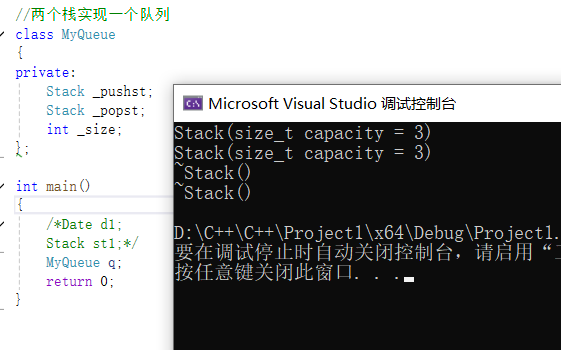


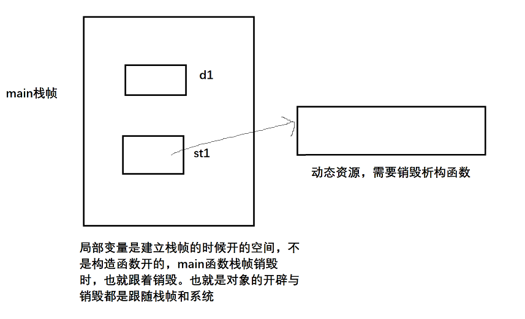

如果不写析构函数，系统默认生成的析构函数不会自动销毁动态开辟的空间，因为过于复杂。


### 拷贝构造


```C++
class Date
{
public:
	Date(int year = 1, int month = 1, int day = 1)
	{
		_year = year;
		_month = month;
		_day = day;
	}

	void Print()
	{
		cout << _year << "/" << _month << "/" << _day << endl;
	 }	
 private:
	 int _year;
	 int _month;
	 int _day;
 };

class Stack
{
public:
	Stack(size_t capacity = 3)
	{
		cout << "Stack(size_t capacity = 3)" << endl;
		_a = (int*)malloc(sizeof(int) * capacity);
		if (nullptr == _a)
		{
			perror("malloc申请空间失败!!!");
		}
		_capacity = capacity;
		_top = 0;
	}
    
    Stack(Stack& stt)
	{
		// 深拷贝
		_a = (int*)malloc(sizeof(int) * stt._capacity);
		if(_a==nullptr)
		{
			perror("malloc fail");
			exit(-1);
		}
		memcpy(_a, stt._a, sizeof(int) * stt._top);
		_top = stt._top;
		_capacity = stt._capacity;
	}

	~Stack()
	{
		cout << "~Stack()" << endl;
		free(_a);
		_capacity = 0;
		_a = nullptr;
	}
private:
	int* _a;
	int _capacity;
	int _top;
};

class MyQueue
{
	Stack _pushst;
	Stack _popst;
	int _size = 0;
};

void func1(Date d) //可以传参传过来，为拷贝一份，浅拷贝
{
	d.Print();
}

void func2(Stack st)
{
	//TODO
}

int main()
{
	Date d1(2023, 10, 22);
	func1(d1);
	Date d2(d1); //这里也是拷贝构造，对于日期类来说没问题

	Stack st1;
	func2(st1);
	Stack st2(st1); //而这里的拷贝构造因为多次析构同一片空间就会崩溃

    MyQueue q1;
	MyQueue q2(q1);
    
	return 0;
}
```


对于上述的代码，我们可以发现，日期类的传值拷贝没有问题，但是Stack的传值拷贝崩溃了

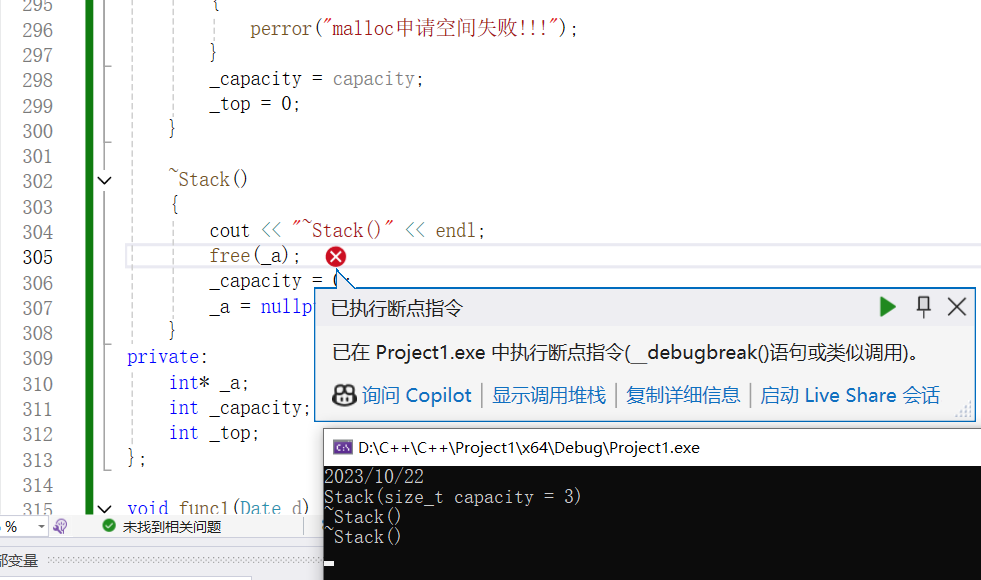


- 对于Stack这类，_a是一段空间，当传值给func2（st）时，离开函数时，_a被释放了一次，就成了野指针了，程序结束又被释放了一次，就造成了崩溃。这个时候浅拷贝就不行了

如何解决问题呢？

规定，自定义类型对象拷贝的时候，调用一个函数，这个函数就叫拷贝构造


如果⼀个构造函数的第⼀个参数是⾃⾝类类型的引⽤，且任何额外的参数都有默认值，则此构造函数 也叫做拷⻉构造函数，也就是说拷⻉构造是⼀个特殊的构造函数。 拷⻉构造的特点： 

1. 拷⻉构造函数是构造函数的⼀个重载。
2. 拷⻉构造函数的第⼀个参数必须是类**类型对象的引⽤**，使⽤传值⽅式编译器直接报错，因为语法逻 辑上会引发⽆穷递归调⽤。拷⻉构造函数也可以多个参数，但是第⼀个参数必须是类类型对象的引 ⽤，后⾯的参数必须有缺省值。 
3. C++规定⾃定义类型对象进⾏拷⻉⾏为必须调⽤拷⻉构造，所以这⾥⾃定义类型传值传参和传值返回都会调⽤拷⻉构造完成。 
4. 若未显式定义拷⻉构造，编译器会⽣成⾃动⽣成拷⻉构造函数。⾃动⽣成的拷⻉构造对内置类型成 员变量会完成值拷⻉/浅拷⻉(⼀个字节⼀个字节的拷⻉)，对⾃定义类型成员变量会调⽤他的拷⻉构造。
5. 像Date这样的类成员变量全是内置类型且没有指向什么资源，编译器⾃动⽣成的拷⻉构造就可以完 成需要的拷⻉，所以不需要我们显⽰实现拷⻉构造。像Stack这样的类，虽然也都是内置类型，但 是_a指向了资源，编译器⾃动⽣成的拷⻉构造完成的值拷⻉/浅拷⻉不符合我们的需求，所以需要 我们⾃⼰实现深拷⻉(对指向的资源也进⾏拷⻉)。像MyQueue这样的类型内部主要是⾃定义类型 Stack成员，编译器⾃动⽣成的拷⻉构造会调⽤Stack的拷⻉构造，也不需要我们显⽰实现 MyQueue的拷⻉构造。这⾥还有⼀个⼩技巧，如果⼀个类显⽰实现了析构并释放资源，那么他就 需要显⽰写拷⻉构造，否则就不需要。 
6. 传值返回会产⽣⼀个临时对象调⽤拷⻉构造，传值引⽤返回，返回的是返回对象的别名(引⽤)，没 有产⽣拷⻉。但是如果返回对象是⼀个当前函数局部域的局部对象，函数结束就销毁了，那么使⽤ 引⽤返回是有问题的，这时的引⽤相当于⼀个野引⽤，类似⼀个野指针⼀样。传引⽤返回可以减少 拷⻉，但是⼀定要确保返回对象，在当前函数结束后还在，才能⽤引⽤返回。


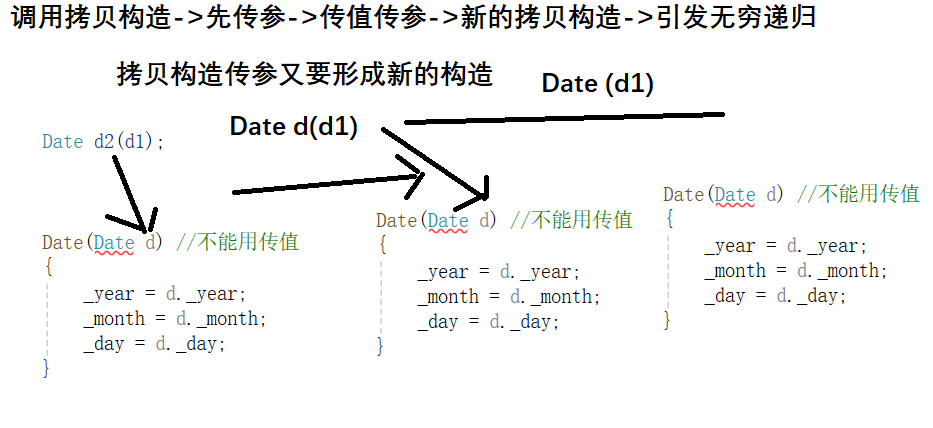

要解决可以用引用或者指针，但是指针没那么好用，只构成重载，不构成复制拷贝

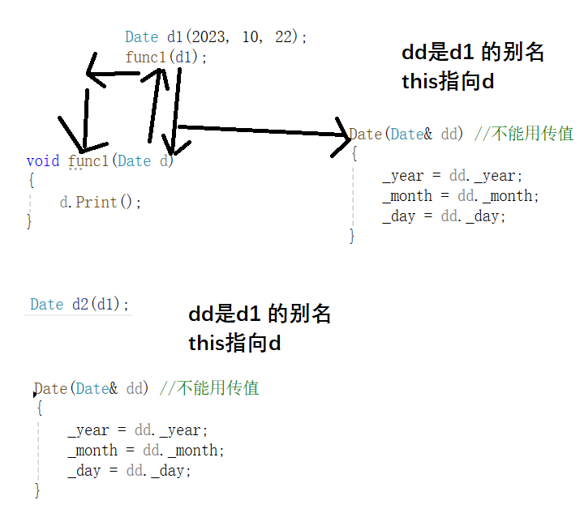


拷贝构造主要解决的是Stack这类的问题，完成深拷贝，值相同，但空间不同。对于Date日期类，MyQueue这种，默认拷贝构造对于内置类型会完成值拷贝、

- 内置类型成员完成值拷贝
- 自定义类型成员调用这个成员的拷贝构造
- Stack需要自己写拷贝构造，完成深拷贝
- 顺序表、链表、二叉树等等的类（自己开空间的，不是对象开空间，MyQueue也自己开了空间，但不需要），都需要深拷贝

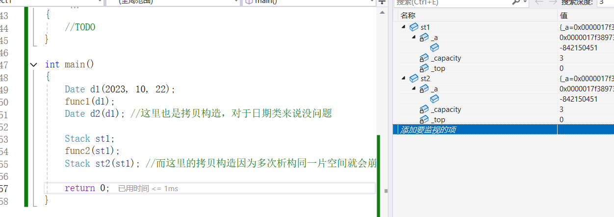

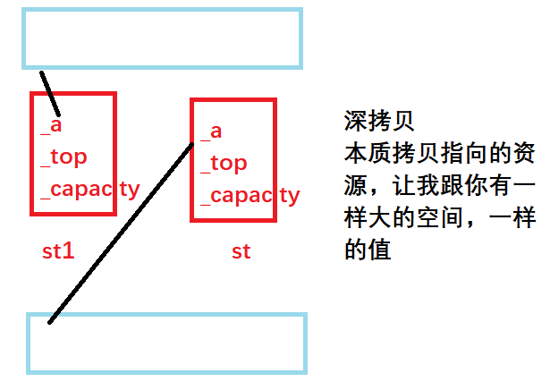

对于MyQueue，可以发现完成了拷贝构造，还都是深拷贝

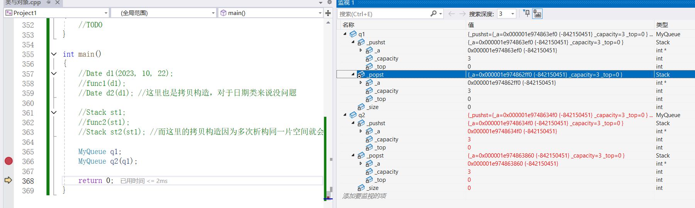

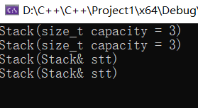


**引用返回**

```C++
class Stack
{
public:
	Stack(size_t capacity = 3)
	{
		cout << "Stack(size_t capacity = 3)" << endl;
		_a = (int*)malloc(sizeof(int) * capacity);
		if (nullptr == _a)
		{
			perror("malloc申请空间失败!!!");
		}
		_capacity = capacity;
		_top = 0;
	}

	// Stack st2(st1)
	Stack(Stack& stt)
	{
		cout << "Stack(Stack& stt)" << endl;
		// 深拷贝
		_a = (int*)malloc(sizeof(int) * stt._capacity);
		if (_a == nullptr)
		{
			perror("malloc fail");
			exit(-1);
		}
		memcpy(_a, stt._a, sizeof(int) * stt._top);
		_top = stt._top;
		_capacity = stt._capacity;
	}

	~Stack()
	{
		cout << "~Stack()" << endl;
		free(_a);
		_capacity = 0;
		_a = nullptr;
	}
private:
	int* _a;
	int _capacity;
	int _top;
};

Stack func1() 
{
	Stack st;
	return st; //这里会发生一次拷贝构造，因为传值返回，返回的不是st本身，而是st拷贝构造形成的临时对象
}

Stack func2()
{
	static Stack st;
	return st; //这里会发生一次拷贝构造，因为传值返回，返回的不是st本身，而是st拷贝构造形成的临时对象
}

Stack func2()
{
	static Stack st;
	return st; //这里会发生一次拷贝构造，因为传值返回，返回的不是st本身，而是st拷贝构造形成的临时对象
}

Stack& func3()
{
	static Stack st;
	return st; //这里不会拷贝构造，因为st不会销毁，所以可以使用引用返回，可以减少一次拷贝构造
}

int main()
{
	func1();
	func2();
	func3();
	return 0;
}
```


### 运算符重载

- 当运算符被⽤于类类型的对象时，C++语⾔允许我们通过运算符重载的形式指定新的含义。C++规 定类类型对象使⽤运算符时，必须转换成调⽤对应运算符重载，若没有对应的运算符重载，则会编 译报错。 
- 运算符重载是具有特殊名字的函数，他的名字是由operator和后⾯要定义的运算符共同构成。和其他函数⼀样，它也具有其返回类型和参数列表以及函数体。
- 重载运算符函数的参数个数和该运算符作⽤的运算对象数量⼀样多。⼀元运算符有⼀个参数，⼆元 运算符有两个参数，⼆元运算符的左侧运算对象传给第⼀个参数，右侧运算对象传给第⼆个参数。
- 如果⼀个重载运算符函数是成员函数，则它的第⼀个运算对象默认传给隐式的this指针，因此运算 符重载作为成员函数时，参数⽐运算对象少⼀个。
- 运算符重载以后，其优先级和结合性与对应的内置类型运算符保持⼀致。 •  不能通过连接语法中没有的符号来创建新的操作符：⽐如operator@。 
-  .*    ::  sizeof  ?:   .  注意以上5个运算符不能重载。(*可以重载，`.*`不行 。选择题⾥⾯常考，⼤家要记⼀ 下)
- 重载操作符⾄少有⼀个类类型参数，不能通过运算符重载改变内置类型对象的含义，如： operator+(int x, int y) int 
- ⼀个类需要重载哪些运算符，是看哪些运算符重载后有意义，⽐如Date类重载operator-就有意 义，但是重载operator+就没有意义。
- 重载++运算符时，有前置++和后置++，运算符重载函数名都是operator++，⽆法很好的区分。 C++规定，后置++重载时，增加⼀个int形参，跟前置++构成函数重载，⽅便区分。 
- 重载<<和>>时，需要重载为全局函数，因为重载为成员函数，this指针默认抢占了第⼀个形参位 置，第⼀个形参位置是左侧运算对象，调⽤时就变成了对象<
- 重载操作符必须有一个类类型参数 不能int operator+(int i,int j), 不能通过重载运算符改变内置类型的运算规则


```C++
class Date
{
public:
	Date(int year = 1990, int month = 1, int day = 1)
	{
		_year = year;
		_month = month;
		_day = day;
	}

	Date(const Date& dd) //不能用传值
	{
		_year = dd._year;
		_month = dd._month;
		_day = dd._day;
	}

	void Print()
	{
		cout << _year << "/" << _month << "/" << _day << endl;
	 }	

	//类内都不受限制，xy的私有都可以访问
	bool operator>( const Date& y)
	{
		if (_year > y._year)
		{
			return true;
		}
		else if (_year == y._year && _month > y._month)
		{
			return true;
		}
		else if (_year == y._year && _month == y._month && _day > y._day)
		{
			return true;
		}
		return false;
	}

	bool operator==( const Date& y)
	{
		return _year == y._year
			&& _month == y._month
			&& _day == y._day;
	}

	int GetMonthDay(int year, int month)
	{
		assert(year >= 1 && month >= 1 & month <= 12);
		int monthArray[13] = { 0,31,28,31,30,31,30,31,31,30,31,30,31 };
		if (month==2&&(year % 4 == 0 && year % 100 != 0) || (year % 400 == 0))
			return 29;
		return monthArray[month];
	}

	int operator-(const Date& y)
	{
		return _year == y._year
			&& _month == y._month
			&& _day == y._day;
	}

	Date operator+=(const int day)
	{
		_day += day;
		while (_day > GetMonthDay(_year, _month))
		{
			_day -= GetMonthDay(_year, _month);
			++_month;
			if (_month == 13)
			{
				_year++;
				_month = 1;
			}
		}
		return *this;
	}


	/*Date operator+(const int day)
	{
		Date tmp(*this);
		tmp._day += day;
		while (tmp._day > GetMonthDay(tmp._year, tmp._month))
		{
			tmp._day -= GetMonthDay(tmp._year, tmp._month);
			++tmp._month;
			if (tmp._month == 13)
			{
				tmp._year++;
				tmp._month = 1;
			}
		}
		return tmp;
	}*/


	Date operator+(const int day)
	{
		Date tmp(*this);
		tmp += day;
		return tmp;
	}

 private:
	 int _year;
	 int _month;
	 int _day;
 };


//bool operator>(const Date& x, const Date& y)
//{
//	if (x._year > y._year)
//	{
//		return true;
//	}
//	else if (x._year == y._year && x._month > y._month)
//	{
//		return true;
//	}
//	else if (x._year == y._year && x._month == y._month && x._day > y._day)
//	{
//		return true;
//	}
//	return false;
//}
//
//bool operator==(const Date& x, const Date& y)
//{
//	return x._year == y._year
//		&& x._month == y._month
//		&& x._day == y._day;
//}

int main()
{
	Date d1(2023, 10, 22);
	Date d2; //这里也是拷贝构造，对于日期类来说没问题

	//运算符重载：operator+符号作为函数名，自定义类型可以直接使用运算符
	//函数重载：可以允许参数不同的同名函数重载
	//他们之间没有关联
	/*cout << operator>(d1, d2) << endl;
	cout << operator== (d1, d2) << endl;*/
	cout << (d1>d2) << endl;
	cout << (d1==d2)<< endl;

	bool ret1 = d1 > d2; //转化为operator>(d1, d2) (全局的)
	//转化为operator>(d2) -> operator>(&d1,d2)
	bool ret2 = d1 == d2; //转化为operator==(d1, d2) (全局的)
	//转化为operator==(d2) -> operator==(&d1,d2)

	d1.operator>(d2); //也可以显示调用
	/*d1 == d2;
	d1 > d2;*/

	//内置类型对象可以直接用各种运算符，内置类型都是简单类型
	// 语言自己定义，编译直接转换成指令
	//自定义类型呢？不可以，因为编译器不知道怎么比较

	//一个类需要重载哪些运算符，主要看这个运算符有没有意义
	//有意义就可以实现，没有意义就不要实现
	//d1 + d2;
	d1 - d2;
	/*d1* d2;
	d1 / d2;*/

	d2 += 50;

	Date ret3 = (d2 + 50);

	int i = 10, j = 0;
	i += 50;
	j += i += 50; //+=从右往左执行

	return 0;
}
```

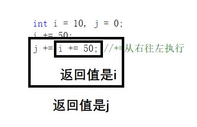


- 当出现很多错误的时候，可以滑动到最上面看，很多错误都是由最上面的错误造成的

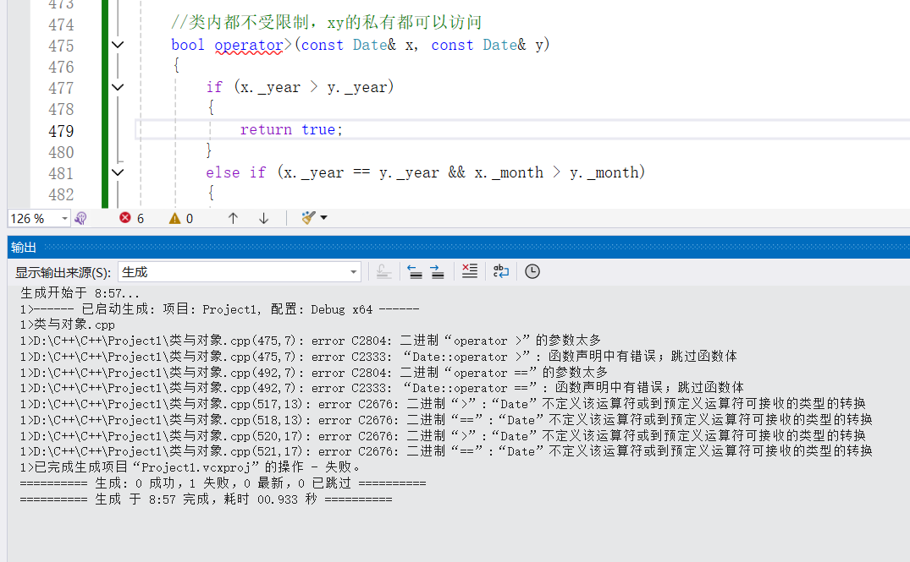

```C++
class Date
{
public:
	Date(int year = 1990, int month = 1, int day = 1)
	{
		_year = year;
		_month = month;
		_day = day;
	}

	Date(const Date& dd) //不能用传值
	{
		_year = dd._year;
		_month = dd._month;
		_day = dd._day;
	}

	void Print()
	{
		cout << _year << "/" << _month << "/" << _day << endl;
	}

		int GetMonthDay(int year, int month)
	{
		assert(year >= 1 && month >= 1 & month <= 12);
		int monthArray[13] = { 0,31,28,31,30,31,30,31,31,30,31,30,31 };
		if (month==2&&(year % 4 == 0 && year % 100 != 0) || (year % 400 == 0))
			return 29;
		return monthArray[month];
	}


	Date operator+(const int day)
	{
		Date tmp(*this);
		tmp._day += day;
		while (tmp._day > GetMonthDay(tmp._year, tmp._month))
		{
			tmp._day -= GetMonthDay(tmp._year, tmp._month);
			++tmp._month;
			if (tmp._month == 13)
			{
				tmp._year++;
				tmp._month = 1;
			}
		}
		return tmp;
	}

	Date& operator+=(int d)
	{
		*this = *this + d;
		return *this;
	}


	//++d1
	Date& operator++()
	{
		*this += 1;
		return *this;
	}

	//自定义类型能用前置就用前置

	//d1++
	Date operator++(int) //(int i)形参可写可不写
	{
		Date temp(*this);
		*this += 1;
		return temp;
	}

	//会导致只能这样调用 d1 << cout;
	//双操作数的运算符，第一个参数是左操作数，第二个参数是右操作数
	//d1.operator<<(&d1,cout); 有this指针
	//Date对象默认占据第一个位置，<<实现成成员函数就是不好的
	/*void operator<< (ostream& out)
	{
		out << _year << "年" << _month << "月" << _day << "日" << endl;
	}*/


	//友元函数
	friend ostream& operator<<(ostream& out, const Date& d);
	friend istream& operator>>(istream& in, Date& d);
private:
	int _year;
	int _month;
	int _day;
};

//out是流插入对象，不能加const，要输入数据进去改变
ostream& operator<<(ostream& out,const Date& d)
{
	out << d._year << "年" << d._month << "月" << d._day << "日" << endl;
	return out;
}

istream& operator>>(istream& in, Date& d)
{
	in >> d._year >> d._month >>d._day;
	return in;
}

//总结：其他运算符一般是实现为成员函数， 
// << >> 流运算符一般实现为全局函数，才能让流对象做第一个参数
// 才符合可读性
// 流本质是为了解决自定义类型的输入和输出问题
// printf scanf无法解决自定义类型的输入输出问题
// 面向对象+运算符重载
// 与左移右移有双重含义，但是左移右移一般是内置类型int

//operaor= 不写编译器会生成默认的
//跟拷贝构造的行为类似，默认的operator= 内置类型值拷贝，自定义类型调用他的赋值
//Date MyQueue 可以不写，默认的operator=就可以用
//Stack必须自己实现operator=，实现深拷贝


class MyClass
{
public:
	void MyFunction(int x)
	{
		//
	}
};

int main()
{
	Date d1(2023, 10, 22);
	Date d2(2022, 1, 22);

	////一个已经存在的对象拷贝初始化另一个对象
	//Date d3(d1);

	////两个已经存在的对象拷贝
	//d2=d1 = d3;
	//d1 = d1;
	//
	//// 语法设计，无法逻辑闭环，只能特殊处理
	//// 特殊处理
	//++d1;
	//d1.operator++();

	//d1++;
	//d1.operator++(1);
	//cin >> d2;
	 
	cout << d1 <<d2<<endl;
	
	//MyClass obj;
	////声明一个成员函数指针
	//void (MyClass:: * MyFunctionPtr)(int) = &MyClass::MyFunction;
	////使用.*运算符调用成员函数
	//(obj.*MyFunctionPtr)(42);

	return 0;
} 
```


### const 成员

- 将const修饰的成员函数称之为const成员函数，const修饰成员函数放到成员函数参数列表的后 ⾯。
- const实际修饰该成员函数隐含的this指针，表明在该成员函数中不能对类的任何成员进⾏修改。 const 修饰Date类的Print成员函数，Print隐含的this指针由 Date* const this

```C++
class date
{
public:
	date(int year = 1990, int month = 1, int day = 1)
	{
		_year = year;
		_month = month;
		_day = day;
	}

	date(const date& dd) //不能用传值
	{
		_year = dd._year;
		_month = dd._month;
		_day = dd._day;
	}

	void print()const
	{
		cout << _year << "/" << _month << "/" << _day << endl;
	}

		int getmonthday(int year, int month)
	{
		assert(year >= 1 && month >= 1 & month <= 12);
		int montharray[13] = { 0,31,28,31,30,31,30,31,31,30,31,30,31 };
		if (month==2&&(year % 4 == 0 && year % 100 != 0) || (year % 400 == 0))
			return 29;
		return montharray[month];
	}


	date operator+(const int day)
	{
		date tmp(*this);
		tmp._day += day;
		while (tmp._day > getmonthday(tmp._year, tmp._month))
		{
			tmp._day -= getmonthday(tmp._year, tmp._month);
			++tmp._month;
			if (tmp._month == 13)
			{
				tmp._year++;
				tmp._month = 1;
			}
		}
		return tmp;
	}

	date& operator+=(int d)
	{
		*this = *this + d;
		return *this;
	}

	bool operator<(const date& d) const
	{
		if (_year < d._year)
		{
			return true;
		}
		else if (_year == d._year)
		{
			if (_month < d._month)
			{
				return true;
			}
			else if (_month == d._month)
			{
				return _day < d._day;
			}
		}
		return false;
	}

	//++d1
	date& operator++()
	{
		*this += 1;
		return *this;
	}

	//自定义类型能用前置就用前置

	//d1++
	date operator++(int) //(int i)形参可写可不写
	{
		date temp(*this);
		*this += 1;
		return temp;
	}

	//会导致只能这样调用 d1 << cout;
	//双操作数的运算符，第一个参数是左操作数，第二个参数是右操作数
	//d1.operator<<(&d1,cout); 有this指针
	//date对象默认占据第一个位置，<<实现成成员函数就是不好的
	/*void operator<< (ostream& out)
	{
		out << _year << "年" << _month << "月" << _day << "日" << endl;
	}*/


	//友元函数
	friend ostream& operator<<(ostream& out, const date& d);
	friend istream& operator>>(istream& in, date& d);
private:
	int _year;
	int _month;
	int _day;
};

//out是流插入对象，不能加const，要输入数据进去改变
ostream& operator<<(ostream& out,const date& d)
{
	out << d._year << "年" << d._month << "月" << d._day << "日" << endl;
	return out;
}

istream& operator>>(istream& in, date& d)
{
	in >> d._year >> d._month >>d._day;
	return in;
}

int main()
{
	//const对象和非const对象都可以调用const成员函数
	const date d1(2025, 11, 19);
	d1.print();

	date d2(2025, 11, 19);
	d2.print();
	d1 < d2;
	d2 < d1;
	return 0;
}
```

成员函数定义的原则：

1. 能定义成const的成员函数都应该定义成const，这样const对象和非const对象都可以调用
2. 要修改成员变量的成员函数，不能定义成const
3. 流插入、输出等不需要，因为const指的是this指针，那不是成员函数


###  取地址运算符重载

​	取地址运算符重载分为普通取地址运算符重载和const取地址运算符重载，⼀般这两个函数编译器⾃动 ⽣成的就可以够我们⽤了，不需要去显⽰实现。除⾮⼀些很特殊的场景，⽐如我们不想让别⼈取到当 前类对象的地址，就可以⾃⼰实现⼀份，胡乱返回⼀个地址。

```C++
class date
{
public:
	date(int year = 1990, int month = 1, int day = 1)
	{
		_year = year;
		_month = month;
		_day = day;
	}

	date(const date& dd) //不能用传值
	{
		_year = dd._year;
		_month = dd._month;
		_day = dd._day;
	}

	void print()const
	{
		cout << _year << "/" << _month << "/" << _day << endl;
	}

		int getmonthday(int year, int month)
	{
		assert(year >= 1 && month >= 1 & month <= 12);
		int montharray[13] = { 0,31,28,31,30,31,30,31,31,30,31,30,31 };
		if (month==2&&(year % 4 == 0 && year % 100 != 0) || (year % 400 == 0))
			return 29;
		return montharray[month];
	}


	date operator+(const int day)
	{
		date tmp(*this);
		tmp._day += day;
		while (tmp._day > getmonthday(tmp._year, tmp._month))
		{
			tmp._day -= getmonthday(tmp._year, tmp._month);
			++tmp._month;
			if (tmp._month == 13)
			{
				tmp._year++;
				tmp._month = 1;
			}
		}
		return tmp;
	}

	date& operator+=(int d)
	{
		*this = *this + d;
		return *this;
	}

	bool operator<(const date& d) const
	{
		if (_year < d._year)
		{
			return true;
		}
		else if (_year == d._year)
		{
			if (_month < d._month)
			{
				return true;
			}
			else if (_month == d._month)
			{
				return _day < d._day;
			}
		}
		return false;
	}

	date& operator++()
	{
		*this += 1;
		return *this;
	}

	date operator++(int) //(int i)形参可写可不写
	{
		date temp(*this);
		*this += 1;
		return temp;
	}

	date* operator&()
	{
		return this;
	}

	// 运算符重载
	const date* operator&()const
	{
		return this;
	}

	//友元函数
	friend ostream& operator<<(ostream& out, const date& d);
	friend istream& operator>>(istream& in, date& d);
private:
	int _year;
	int _month;
	int _day;
};

ostream& operator<<(ostream& out,const date& d)
{
	out << d._year << "年" << d._month << "月" << d._day << "日" << endl;
	return out;
}

istream& operator>>(istream& in, date& d)
{
	in >> d._year >> d._month >>d._day;
	return in;
}

int main()
{
	//const对象和非const对象都可以调用const成员函数
	const date d1(2025, 11, 19);
	d1.print();

	date d2(2025, 11, 19);
	d2.print();
	d1 < d2;
	d2 < d1;


	// 如果将两个&重载都注释掉,一样可以编译,因为这是默认成员函数
	// 如果将date*版本注释掉,一样可以走const版本编译
	cout << &d1 << endl;
	cout << &d2 << endl;
	return 0;
}
```


### 再谈构造函数

- 之前我们实现构造函数时，初始化成员变量主要使⽤函数体内赋值，构造函数初始化还有⼀种⽅ 式，就是初始化列表，初始化列表的使⽤⽅式是以⼀个冒号开始，接着是⼀个以逗号分隔的数据成 员列表，每个"成员变量"后⾯跟⼀个放在括号中的初始值或表达式。 
- 每个成员变量在初始化列表中只能出现⼀次，语法理解上初始化列表可以认为是每个成员变量定义 初始化的地⽅。 
- 引⽤成员变量，const成员变量，没有默认构造的类类型变量，必须放在初始化列表位置进⾏初始 化，否则会编译报错。 •  C++11⽀持在成员变量声明的位置给缺省值，这个缺省值主要是给没有显⽰在初始化列表初始化的 成员使⽤的。 
- 尽量使⽤初始化列表初始化，因为那些你不在初始化列表初始化的成员也会⾛初始化列表，如果这 个成员在声明位置给了缺省值，初始化列表会⽤这个缺省值初始化。如果你没有给缺省值，对于没 有显⽰在初始化列表初始化的内置类型成员是否初始化取决于编译器，C++并没有规定。对于没有 显⽰在初始化列表初始化的⾃定义类型成员会调⽤这个成员类型的默认构造函数，如果没有默认构 造会编译错误。 
- 初始化列表中按照成员变量在类中声明顺序进⾏初始化，跟成员在初始化列表出现的的先后顺序⽆ 关。建议声明顺序和初始化列表顺序保持⼀致。


```C++
class Time
{
public:
	Time(int hour)
		:_hour(hour)
	{
		cout << "Time()" << endl;
	}
private:
	int _hour;
};

class Date
{
public:
	//Date(int year = 1990, int month = 1, int day = 1)
	//{
	//	_year = year;
	//	_month = month;
	//	_day = day;
	//}


	//Date(int year = 1990, int month = 1, int day = 1)
	//	:_year(year),_month(month),_day(day),_ref(year),_n(1)
	//{
	//	//初始化列表
	//	//_ref
	//	//_n
	//}


	Date(int year = 1990, int month = 1, int day = 1)
		: _ref(year), _n(1),_t(10) //每个成员定义 _year
	{
		// 剩下3个成员没有在初始化列表显示写出来定义
		// 但是他也会定义,只是内置类型默认给的随机值
		//如果是自定义类型成员会去调用他的默认构造函数

		_year = year;
		_month = month;
		_day = day;
	}

private:
	// 声明 并没有开空间
	int _year =1; //缺省值,是给初始化列表的,如果显示的传参了就没用
	int _month;
	int _day;

	Time _t; //自定义类型成员(且该类没有默认构造函数时)

	//
	int& _ref;//引用:必须在定义的时候初始化
	const int _n; //const:必须在定义的时候初始化
};

class Stack
{
public:
	Stack(int n = 4)
		:_a((int*)malloc(sizeof(int)* n))
		, _top(0)
		, _capacity(n)
	{
		cout << "Stack(int n=4)" << endl;
		if (_a == nullptr)
		{
			perror("malloc fail");
			exit(-1);
		}
		memset(_a, 0, sizeof(int) * n);
	}

	int* _a;
	int _top;
	int _capacity;
};


// 初始化列表解决的问题:
// 1 必须在定义的地方显式初始化 引用 const 没有默认构造函数自定义成员
// 2 有些自定义成员想要显式初始化,自己控制
// 尽量使用初始化列表
// 构造函数能不能只要初始化列表,不要函数体初始化呢
// 不能,因为有些初始化或者检查工作,初始化列表也不能全部搞定
// 80-1--%初始化列表搞定,还要需要函数体,他们可以混着用
class MyQueue
{
public:
	// 没写初始化列表也会初始化
	// 不写初始化列表也会走初始化列表,因为初始化列表是它定义的地方
	// 这里的MyQueue写不写效果一样
	MyQueue()
	{}

private:
	Stack _s1;
	Stack _s2;
	int _size = 0;
};

int main()
{
	// 定义:对象整体定义
	// 每个成员在什么地方定义呢?-->初始化列表
	Date d1(2023, 1, 3);

	//int& x;
	//const int y;
	return 0;
}
```


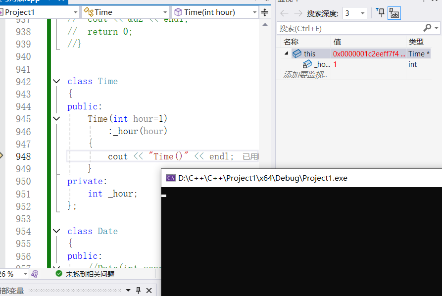

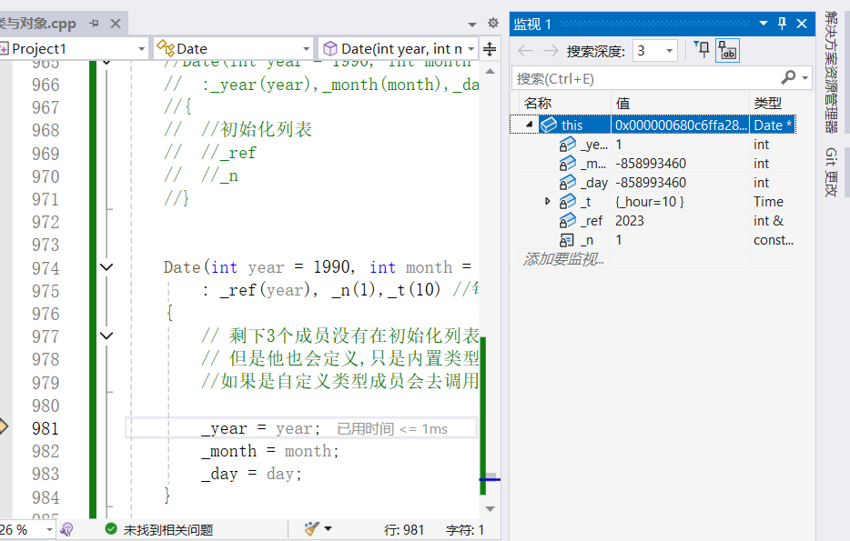

```C++
 #include<iostream>
 using namespace std;
 class A
 {
 public:
 A(int a)
 :_a1(a)
 , _a2(_a1)
    {}
    void Print() {
        cout << _a1 << " " << _a2 << endl;
    }
 private:
    int _a2 = 2;
    int _a1 = 2;
 };
 int main()
 {
    A aa(1);
    aa.Print();
 }

上⾯程序的运⾏结果是什么（）
A. 输出1 1
 B. 输出2 2
 C. 编译报错
D. 输出1 随机值
E. 输出1 2
 F. 输出2 1
```

**成员变量在类中的声明次序就是其在初始化列表中的初始化顺序，与其在初始化列表中的先后次序无关**

**建议声明顺序和初始化列表顺序保持一致，避免出现理解问题**

